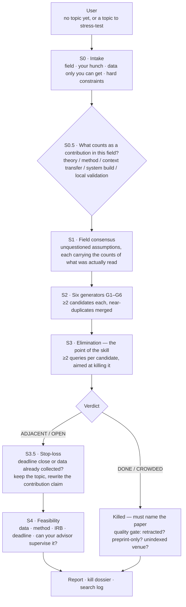

# research-gap-hunter — Thesis Topic Elimination Skill for LLM Agents

**English** | [繁體中文](README.zh-TW.md)

An agent skill for the stage *before* you have a topic. Ask an LLM for "an innovative thesis topic" and it will interpolate inside its training distribution and hand you the smoothest, best-attested, therefore most-already-done path in the field — that is a property of the mechanism, not of your prompt. So this skill does not try to generate novelty. It deliberately over-generates candidates, then spends its entire budget trying to **kill** them with journal search, and reports whatever survives: **has someone already done this, and can you name the paper that proves it?**

Built by a grad student finishing a thesis, for his own use. The skill itself is prose — no runtime, no API keys, nothing to install. The Python in this repo is offline tooling only: the format checker, the repo and package scanners, a fixture generator and a packager. None of it runs during a hunt.

## Architecture



Three rules run through every path: every elimination must **name the paper that killed it**; every assumption in the consensus map carries **the counts of what was actually read to derive it**, kept separate from the counts of the search run to refute it; and every candidate that gets a novelty verdict must have a **matching row in the search log**, or it is downgraded to unverified and moved to the pending section.

## What this is not

**If you already have two specific concepts and only want to know whether their intersection has been done, use lit-review's `gap` command — it answers that in two or three queries and a few minutes, and this skill has no advantage there.** lit-review also owns everything *after* a topic is chosen: reference hunting, citation auditing, retraction lookup, full-text location, RIS and EndNote export. Those are out of scope here by design.

The boundary is a **stage**, not a rivalry. It is about who owns the candidate at the moment you ask.

| What you are actually asking | lit-review `gap` | research-gap-hunter |
|---|---|---|
| "Has anyone done X × Y?" — you already named X and Y | ✅ 2–3 queries, minutes | overkill; don't start it |
| "I have no topic at all" | — | ✅ intake → generate → eliminate |
| "Is the topic I already have novel enough?" | — | ✅ treated as a single candidate, straight to elimination |
| Produce candidate directions you had not thought of | — | ✅ six structural generators |
| "Does this reference exist? Is the bibliography right?" | ✅ | never checks — not once |
| Retraction, full text, RIS / EndNote export | ✅ | borrows lit-review's script for existence checking, retraction, snowballing and export |
| Write the literature review chapter | ✅ | out of scope by design |

One-line routing rule: **candidate does not exist yet → this skill; candidate is already named → lit-review.** The two never contend for the same turn, because this skill calls lit-review's *script* directly, and its elimination step never invokes the `gap` command. (`gap` is allowed once, later: after the survivors are fixed, the hand-off step may run it on a single intersection.)

## What it does

**Step 0 — Intake.** Four things, asked once: field and sub-field; where the literature makes you frown; **data you can get and other people cannot**; and hard constraints (time, money, method, IRB, advisor red lines). The third is the largest single lever, because a model has never seen your data. If you decline to answer, the run degrades explicitly and says which generator went dark — it does not quietly guess.

**Step 0.5 — Contribution criterion.** Not every field measures contribution by literature novelty. Applied, clinical, design and in-service master's programmes often measure it by replication in a new operating context. Where that is the criterion, a thick literature is not a reason to kill a candidate.

**Step 1 — Field consensus.** Extract the assumptions nobody is questioning: the population everyone uses, the one instrument everyone trusts, the time scale, the assumed causal direction, the level of analysis, the untested boundary conditions. Each assumption is written with the sample frames kept apart: `N` titles scanned (the query and its limit), `M′` abstracts actually read, of which `M` carry the assumption, plus a *separate* refutation search returning `K′` papers of which `K` genuinely tested it. **`N` is not the denominator of `M`** — those abstracts were never read — and `K` comes from a different search, so it is unrelated to `N` and may exceed `M′`. An assumption resting on fewer than three read abstracts is marked 〔impression, unverified〕, and impressions cannot feed generator G3.

**Step 2 — Six generators.** G1 negative space (who has never been studied) · G2 cross-domain transplant (which discipline solved a structurally isomorphic problem) · G3 assumption inversion · G4 contradiction hunting (clashing effect sizes, failed replications) · G5 construct-validity gaps (claims to measure X, measures Y) · G6 the untrained data from Step 0. Every candidate must be written as a **testable statement**, not a topic phrase. The target is coverage, not headcount: two per generator, near-duplicates merged *before* candidate ids are handed out — once a candidate is numbered it keeps its own row everywhere, so nothing can be merged away later — and "G*n* does not apply here, because…" written out rather than padded.

**Step 3 — Elimination.** Two or more queries per candidate, and the mindset is the whole method: **you are searching to kill it, not to confirm it.**

| Verdict | Means | What the report must contain | Outcome |
|---|---|---|---|
| **DONE** | someone has already done this same thing | the paper with an identifier, **the sentence from its abstract quoted verbatim**, and a match on all four of population / treatment / outcome / design | eliminated |
| **CROWDED** | not identical, but the question is already thick with literature | **≥3 papers, each annotated with which sub-question of yours it covers**; if any sub-question is left uncovered it is not CROWDED | eliminated |
| **ADJACENT** | the neighbours are done, this cell is empty | the nearest neighbour with an identifier; which axis differs and why that difference should change the result; and a check of whether that paper's own limitations/future work already names your gap | survives |
| **OPEN** | two or more queries return almost nothing | ≥3 queries including one terminology-corrected retry, plus a forward-citation check on the nearest neighbour *where the retry finds one* — a genuinely blank OPEN writes `不適用（無最近鄰）` verbatim in that field instead of inventing a neighbour to snowball from | survives, treated as a suspicious signal |

A fifth verdict survives without claiming a gap: `INCREMENTAL` means it has been done before and doing it anyway is still a legitimate contribution in your situation — the recommendation is to **keep your topic and rewrite the contribution claim**, not to hunt for a replacement.

**Not every candidate earns a verdict, and the report has a bucket for that.** Candidates land in exactly one of three sections: survivors (`ADJACENT` / `OPEN` / `INCREMENTAL`), eliminated (`DONE` / `CROWDED` only), or **pending — evidence insufficient, not yet decided**. Pending is where a title that merely looks similar goes (`DONE?`), and where `UNSEARCHABLE` goes when the terminology is wrong rather than the field empty, and a G2 transplant whose structural isomorphism was never operationalised, and a G5 construct claim with no full text, and a G4 contradiction observed without a mechanism, and a gap the nearest neighbour's own future-work section already announced, and a preprint-only hit that is a scheduling race rather than a kill. Each pending row must state **which piece of evidence is missing and the concrete action that would close it** — the point is that nothing is allowed to disappear quietly. The header carries the reconciliation `generated N = survived M + pending P + eliminated Q`; it is an accounting identity, not a quota.

**Step 3.5 — Stop-loss.** If the deadline is close or the data is already collected, the default recommendation is to keep the topic. A skill that manufactures a pivot the user cannot afford has done harm, not work.

**Step 4 — Feasibility.** Data, method, IRB, deadline — plus two things the model cannot judge and must hand back: can your advisor actually supervise this, and will your committee accept the contribution in the language of your department.

**Step 5 — Report.** A fixed seven-section structure: consensus map and assumptions · surviving candidates with search evidence · pending candidates with what each one is missing · the elimination table with the killing paper and its identifier on every row · a next-week action list · a verbatim search log · a copy-paste checkable list of DOIs for lit-review.

**Worked walkthrough: [`examples/worked_example.md`](examples/worked_example.md)**

## Quick start

**Claude Code:**

```bash
git clone https://github.com/Zachariah9420/research-gap-hunter-skill- ~/.claude/skills/research-gap-hunter
```

The destination folder must be named `research-gap-hunter` (the skill name), not the repo name.

Then just ask: *"I can't find a thesis topic in <field>"* or *"is my topic actually novel?"* — the skill will confirm before starting, because a full run means answering four questions and then dozens of searches. If you want a sample rather than a census, say so: a one-candidate reconnaissance run is a supported mode, but it is deliberately a **weaker product** — 1 candidate, 2 searches, about five minutes, and it emits **no novelty verdict at all**, only 〔DONE?〕 or 〔待再查〕 (needs another look). The report labels itself as a sample, and turning any of it into a verdict requires the full pass.

**Codex / other agents:** add one line to your `AGENTS.md`:

> To find or stress-test a research topic, read `<clone-path>/SKILL.md` and follow its workflow.

Nothing to install. `SKILL.md` carries the workflow, the verdict table, the honesty rules and the fixed output format; the heavier operational detail sits in two files under [`references/`](references/), each read only when its step runs. [`references/generators.md`](references/generators.md) holds G1–G6 with the evidence each one owes, its characteristic false positive, and where a candidate lands when that evidence is missing. [`references/elimination-engine.md`](references/elimination-engine.md) holds the portable `lit_api.py` path detection, the search funnel contract, the per-command gotchas, the four-tier degradation ladder, the Chinese-index rules and the EndNote hand-off.

## Optional: lit-review (recommended — it is what makes elimination hold)

This skill works standalone, but its verdicts are only as good as the search behind them. If **lit-review** is present, elimination gets machine checks it cannot otherwise have:

```bash
git clone https://github.com/Zachariah9420/lit-review-skill ~/.claude/skills/lit-review
```

| Without lit-review | With it | Why it matters |
|---|---|---|
| abstracts read ad hoc | `search` → `brief` → `pick` | a DONE verdict can quote a real abstract sentence instead of matching a title |
| the killing paper is asserted | `verify` | `not_found` voids the kill and the candidate comes back to life |
| retraction unchecked | `retract` | a retracted paper must not be allowed to kill a topic; zero LLM cost, so it runs on every killer, not a sample |
| a preprint can kill a topic | `versions` | a preprint-only killer downgrades DONE to "someone is racing you", which is a scheduling risk, not a novelty kill |
| "nobody has done it" may be 18 months stale | `snowball --direction citations` | shows who is filling the gap right now |
| G4 / G5 asserted from abstracts | `fulltext` | effect sizes and instrument critiques need the paper, not the abstract |
| kill reasons lost | `export-xml` | why a direction died goes into EndNote's Research Notes, where you will look for it in three months |

Two details worth knowing. First, this skill calls the **script** (`lit-review/scripts/lit_api.py`, pure Python 3.8+ standard library) and never loads the lit-review skill itself — so there is no token cost and no trigger collision. Second, detection runs once and the result is printed in the report header, so you can always tell which tier a verdict came from. The tier also decides **how many generators can run**: the quantified sample frame in Step 1 is built out of `brief` and `pick`, so at the web-search-only tiers every assumption is marked 〔impression, unverified〕 and G3 — assumption inversion — has no legitimate input and writes "not applicable" instead, while G5 loses `fulltext` and can only proceed if you find an open-access PDF yourself and actually read its measures section. **Four of the six generators run normally there — G1, G2, G4, G6** — and the report's degradation note has to say so rather than pad the list with candidates whose evidence was never obtainable. **Without lit-review there is no cheap substitute for the retraction check either; the report says `retraction check: not performed` rather than implying it passed.**

## Packaging for upload (ChatGPT Skills, or sharing)

A cloned folder is **not** directly uploadable — zipping it would include the `.git` directory, and the top-level folder would be named after the repo rather than the skill. One command produces a correct package:

```bash
python scripts/package_skill.py          # → research-gap-hunter.zip
```

It takes the file list from **`git ls-files`**, so the package contains exactly what a clone contains (nothing gitignored, no `.git`, no `.env`). That has one consequence worth stating plainly: **an uncommitted file is not in `git ls-files` and therefore is not in the ZIP** — this is deliberate, since unversioned work should not be shipped, but it means you must `git add -A && git commit` *before* packaging or you will hand someone a skill with pieces missing. The script wraps the result in a `research-gap-hunter/` top-level folder so `SKILL.md` sits where the platform expects it, then runs `evals/zip_check.py` for API keys, personal email addresses and machine-specific paths. **If that check fails the ZIP is deleted rather than handed to you** — a package that leaks is worse than no package.

## What is machine-checked (and what is not)

Be clear about the shape of the guarantee here, because it is weaker than lit-review's and the difference matters.

```bash
python evals/format_check.py <report.md>          # a produced report obeys the structural rules
python evals/format_check.py <report.md> --json   # same findings, machine-readable
python evals/self_test.py                         # 27 fixtures; each must land on its expected check id
python evals/mutation_test.py                     # 21 mutants; proves each rule is what catches its fixture
python evals/make_fixtures.py --check             # no fixture on disk has been hand-edited away from its generator
python evals/doc_scan.py                          # what these docs claim vs what the repo actually contains
python evals/zip_check.py <zip>                   # no keys, no personal paths, no .git in the package
```

`doc_scan.py` is the one that guards this page: it reads the check count out of `format_check.py`, the fixture count off disk and the mutant count out of `mutation_test.py`, and exits non-zero if any number, file path, command or relative link written in the READMEs has drifted from the repo. Every count below is one it verifies, so a stale number here fails a run rather than sitting quietly in prose.

`format_check.py` is deterministic, needs no network and costs nothing. It declares **21 checks**, and this is what they actually enforce: the report contains the required sections and declares which literature-tool tier it ran at; the declared survivor count equals the number of candidate blocks actually written, and the generated count is not smaller than it; **the candidate settlement reconciles — generated N = survived M + pending P + eliminated Q, each of those three numbers matches the section it names, and every candidate id appears in exactly one of sections 二/三/四**, which is the repo's one structural guard against a candidate quietly disappearing between generation and report; every verdict is inside the allowed vocabulary, and only survivor verdicts appear in the survivor list; **a quantified assumption carries its whole split sample frame (titles scanned, the query and its limit, abstracts read M′ with their `pick` indices, of which M carry it, the separate refutation search returning K′ of which K were read, and the sample source) with M ≤ M′, K ≤ K′ and M′ ≥ 3 — anything thinner must be written 〔impression, unverified〕; and a G3 candidate must name the assumption it inverts, which may not be an impression-level one**; every survivor carries a search-evidence field that is neither empty nor a placeholder and contains at least one concrete, re-runnable query; every survivor has a matching row in the search log, and those query cells are not placeholders either; a named nearest study carries an identifier; every eliminated row names its killing literature and that literature carries a DOI, arXiv id or S2 id; a `DONE` reason contains a verbatim quoted sentence; a `CROWDED` row names at least three papers; no line asserts non-existence rather than reporting a search result; and a run that declares no search backend may not fill in a single verdict. The full table, with why each rule exists, is in [`evals/README.md`](evals/README.md).

One thing in this area it does **not** check — named here because earlier drafts of this README got the boundary wrong in both directions: it does **not** verify that a `CROWDED`'s three papers each cover a *distinct sub-question*. `KILL-02` counts papers and nothing else, so three papers all answering the same sub-question pass while the rest of your question stays uncovered — that mapping exists in prose only, and you have to read those rows with your own eyes. Two claims that used to sit here were wrong in the other direction: the assumption list *is* inspected (`ASSUM-01`) and an impression-level assumption *is* barred from feeding G3 (`ASSUM-02`), each with its own fixture and mutant. What no checker can do is tell whether the sample-frame numbers are real — the frame is verified for presence and internal consistency, never for truth.

**It checks the report's form. It cannot check whether a single citation in it is true.** A fabricated but well-formatted report passes.

`self_test.py` runs the checker across 27 fixtures — six that must come back clean (a full report, the degraded no-search report, a bracketed-state report, a report block embedded in a teaching document, a partially-searched report whose never-searched candidates are exempt from the search-log interlock, and a second hand-written report pinning the 「不適用」 Chinese-index value) plus one deliberately broken report per rule — asserting the exact set of check ids each one raises, that the human-readable and `--json` modes agree on the exit code, and that every declared check id owns a fixture, so a rule cannot quietly go untested. It also re-runs `make_fixtures.py --check`, so a fixture that was hand-edited into breaking a second dimension fails the suite instead of silently making some other rule look tested. `mutation_test.py` then weakens each rule's *condition* in a throwaway copy of the checker and confirms its fixture stops being flagged, which is what proves the rule you believe is guarding a case is the rule actually catching it. That is a **self-test of the checker, not a behavioural regression suite**: lit-review can freeze behaviour because it has production functions to freeze, and this skill has no runtime at all. Its correctness lives in prose that a model chooses to follow, and no test here can reach it.

What has actually been exercised on real material: **nothing yet.** The skill has not been run end-to-end on a real topic search, the rules in it come from an adversarial review of the design rather than from observed failures, and the field-applicability claims below are reasoning, not measurement. That is the honest state of it today, and it should be read as the frontier, not as modesty.

## Design principles

- **Elimination, not generation.** Novelty produced by a language model is the field's most-travelled path wearing new words. Novelty that survives twenty attempts to kill it is worth something.
- **Every elimination names its killer.** DONE names one paper and quotes the sentence; CROWDED names three and says which sub-question each one covers. There is no survivor quota — the survivor count is whatever the evidence yields, and a high count means "search coverage may be thin", not "try harder to kill things".
- **Killing is held to the same standard as claiming novelty.** A false OPEN is self-correcting: you keep reading, your advisor knows the field, the paper eventually surfaces. A false DONE is silent and permanent — it looks like a clean conclusion in a report and the idea is never reopened.
- **Assumptions carry their sample frames.** Titles scanned, abstracts actually read, how many of those carried the assumption, and separately what a search aimed at refuting it returned — or the assumption is marked as impression and is barred from feeding generator G3. The assumption list is the most insight-looking and most hallucinable artifact in the whole run, so the checker does hold the frame to account — it must be present and internally consistent (M ≤ M′, K ≤ K′, M′ ≥ 3) and an impression may never feed G3 — but no checker can tell you the numbers are real. That part is yours.
- **"Not found" is a search result, never a claim of non-existence.** Every OPEN verdict is written as the result of specific queries on specific indexes on a specific date.
- **The search log is the report.** A candidate with no row in the log gets no novelty verdict — it is marked unverified and moved to the pending section, where it stays visible. Without that rule, every other honesty rule is self-declared.
- **Feasibility is part of novelty.** A topic nobody in your department can supervise has a feasibility of zero — and the more novel it is, the more likely that is exactly what has happened.
- **Never manufacture a pivot the user cannot afford.** For a student two months from submission with data already collected, "your topic is incremental and that is a legitimate master's contribution, let's rewrite how you frame it" is the correct output, not six replacement directions.

## Field applicability (asserted, not measured)

**Asserted, not measured:** unlike lit-review's field table, no session has run this skill over these literatures. What follows is reasoning from the design — exactly the kind of claim the skill itself would mark 〔impression, unverified〕. It is here because the failure modes are structural and predictable, not because they have been observed.

| Field | Expected to hold | Expected to fail or mislead |
|---|---|---|
| **CS / AI / English-language engineering** | The design's home ground: literature is in English, indexed, DOI-bearing, abstract-rich | — |
| **Applied / clinical / design / practice-oriented** | Generators G1, G2 and G6 still produce usable candidates | The premise "gap = value" does not hold. A dense literature is a reason to test the effect in your new setting, not a reason to abandon it — so a run that returns fifteen CROWDED verdicts may be technically correct and practically wrong. Set the contribution criterion at Step 0.5 or the whole run is calibrated to the wrong target |
| **Taiwan-bounded / Chinese-language / single-institution** | The intake, generators and feasibility filter work normally | Elimination does not. The prior work sits in NDLTD, Airiti and TCI, which this skill cannot search — see limitations below |
| **Mathematics / theoretical science** | — | Novelty here means "this proposition has not been proved", and keyword search over journals cannot establish that. The skill should refuse to issue a verdict and point you at zbMATH / MathSciNet and a human expert. A verdict it cannot support is worse than admitting the tool does not apply |

## Honest limitations

Read this section before you act on any verdict this skill produces.

- **The skill cannot notice that something is wrong. Only you can.** Noticing that a finding does not match what you see in practice, that a conclusion feels off, that everyone measures the thing the same way and it has always bothered you — that act is not available to a model. What the skill does is take a hunch *you* already had and stress-test it fast: locate which kind of gap it is, and find out whether someone has already been there. If you bring no hunch, it will still run, and the result will be structurally competent and less valuable.
- **English-only search systematically underestimates locally-bounded and Chinese-language literature.** The default is English because journal indexes are English-dominant, but for a topic bounded to Taiwan, to Chinese-language corpora, to local regulation or to one institution, the prior work lives in NDLTD, Airiti and TCI — and this skill has **no access to any of them**, with or without lit-review. English-only search on such a topic returns near-zero hits, which the verdict table maps to OPEN, which is manufactured novelty. This is a hard boundary, not a rough edge: the report is required to say the Chinese indexes were not searched, and you must check them yourself before believing an OPEN.
- **Abstract-level elimination cannot settle G4 or G5 candidates.** Contradiction hunting needs the moderators, inclusion criteria and analytic choices that explain *why* two studies disagree; construct-validity claims need the actual item wording, which appears in the measures section and never in an abstract. Candidates from those two generators are barred from the survivor list and given no novelty verdict; they go into the pending section carrying the reason they are stuck and the action that would unstick them — because a confidently wrong claim about an entire literature's foundations is the worst output this skill could produce, and quietly dropping the candidate is the second worst.
- **"Not found" is a search result and never a claim of non-existence.** The most common reason a search returns nothing is the wrong query term, not an empty field. Genuinely untouched questions are rare, and when they are real they often mean the field considers the question unimportant — which is a different risk you still have to weigh.
- **Cross-domain transplants (G2) cannot search for themselves.** A candidate that moves a method from ecology into organisational research is, by definition, not indexed under the name you would give it, so it tends to survive on a technicality while the real prior work sits under the target field's own vocabulary. It is also the generator whose output sounds cleverest. It carries a heavier burden of proof, not a lighter one.
- **Honesty here rests on prose discipline, not on a behavioural regression suite.** lit-review can enforce its promises with 74 frozen cases because it has production code to enforce them against. This skill has no runtime, so what `evals/` freezes is the *checker*, not the skill: `format_check.py` checks only that a report has the required **shape**, and `self_test.py` / `mutation_test.py` only prove that this checker still does what it says. A report can satisfy every structural rule and still be entirely fabricated. If a run declares no search backend and then produces confident verdicts anyway, that is the failure mode — `TIER-01` catches that one specific case, and the search log exists so you can catch the rest yourself.
- **Nothing has been validated in real use.** No end-to-end run on a real thesis search has been recorded, no user has been observed choosing a topic through it, and no verdict has yet been checked against what the literature actually contained. Every rule in it comes from reviewing the design, not from watching it fail.
- **It cannot tell you whether your advisor will supervise this, or whether your committee will accept the contribution.** Those constraints decide whether a topic is viable at least as often as novelty does, and both are handed back to you deliberately rather than guessed at.

## Example

[`examples/worked_example.md`](examples/worked_example.md) is a worked run with a known answer key: candidates that must come back eliminated with a quoted abstract sentence and a named killer, a Taiwan-bounded candidate that must trigger the Chinese-index exception instead of a false OPEN, a candidate whose false OPEN is overturned by a terminology-corrected retry, and **two that should survive** — one ADJACENT, one INCREMENTAL. Run the skill yourself and see whether they land where they should.

It is a **teaching walkthrough that embeds report fragments in commentary**, not a clean report file: it quotes the forbidden wording in order to argue against it, and it interleaves explanation between the sections. So its embedded report is fenced with `<!-- format-check: report-start -->` and `<!-- format-check: report-end -->`, and `format_check.py` reads only what is inside that fence: the file exits 0 today, and `self_test.py` requires it to keep doing so, so an edit that breaks the embedded report turns the suite red. The teaching prose outside the fence is deliberately unchecked — and inside it, no rule is relaxed, `LANG-01` included; see [`evals/README.md`](evals/README.md) 〈Narrative documents — the report block〉 for why quoting a forbidden sentence earns no exemption. The fully machine-checked specimens are the fixtures under [`evals/fixtures/`](evals/fixtures/), whose bibliography is entirely synthetic and must never be cited.

---

MIT License. Issues and PRs welcome.
