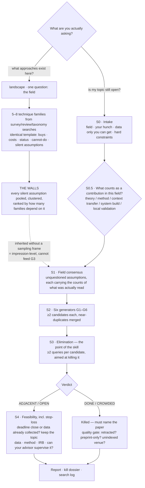

# research-gap-hunter — Field Orientation, then Thesis Topic Elimination, for LLM Agents

**English** | [繁體中文](README.zh-TW.md)

An agent skill for the stage *before* you have a topic. It has two layers, because "where am I?" and "is this still open?" are different questions that deserve very different amounts of money.

**Layer 1 · `landscape` — see the field.** Cheap orientation. You give it one thing (the field) and it comes back with the technique families in play, each on an identical template: what it is, what it *buys* you, what it *costs* you, whether it is saturated or still moving, what it structurally cannot do, and what it silently assumes. Then it pools every silent assumption across every family, clusters them, and ranks them by how many families depend on each. That last table is called **the walls**. It eliminates nothing and judges nothing novel.

**Layer 2 · `hunt` — decide what is still open.** Expensive verdicts. Ask an LLM for "an innovative thesis topic" and it will interpolate inside its training distribution and hand you the smoothest, best-attested, therefore most-already-done path in the field — that is a property of the mechanism, not of your prompt. So this layer does not try to generate novelty. It deliberately over-generates candidates, then spends its entire budget trying to **kill** them with journal search, and reports whatever survives: **has someone already done this, and can you name the paper that proves it?**

The layers connect in one place: the walls from layer 1 are exactly what layer 2's first step consumes. Running layer 1 first is the cheap path through layer 2, and stopping after layer 1 is a legitimate ending.

Built by a grad student finishing a thesis, for his own use. The skill itself is prose — no runtime, no API keys, nothing to install. The Python in this repo is offline tooling only: the format checker, the repo and package scanners, a fixture generator and a packager. None of it runs during a landscape or a hunt.

## Two layers, two evidence standards

| | `landscape` — 領域地形 | `hunt` — 缺口獵捕 |
|---|---|---|
| Answers | what approaches exist here, what each buys and costs, which are saturated and which are moving | is this topic still open, and can you name the paper that closes it |
| Costs you | one question, then three derivation rounds plus one to three searches per family | four intake questions, then dozens of searches, one kill attempt per candidate |
| Produces | a field-landscape report ending in **the walls** | a research-gap report: survivors, pending, eliminated, plus the verbatim search log |
| Checks the literature it cites | **not at all** | existence, retraction, publication type, and the four-way match behind every kill |
| Says "nobody has done X" | never — it is forbidden to | never — it reports what specific queries on specific indexes returned |

Ask for the one you want. If it cannot tell, the skill asks a single routing question before spending anything.

**Why the bars differ, honestly.** The hunt's evidence bars are high because a verdict is a decision someone acts on: a `DONE` needs the abstract sentence quoted verbatim *and* a match on all four of population / treatment / outcome / design; a `CROWDED` needs three papers each mapped to a distinct sub-question of yours. Those bars are correct for a verdict. They are the wrong instrument for orientation, and there is a number attached: in a measured four-run trial of the hunt, **52% of all candidates ended in 「待確認」 — "I could not determine this."** For a verdict that is the honest and defensible outcome; nothing quietly disappeared. For someone who just wants to know where he is standing, a report that is half shrugs is useless.

So landscape runs a deliberately lower bar, and the lowering is in the *quantity of evidence*, not in the honesty standard: 3–6 anchor papers per family, representative rather than exhaustive; trends written only as a search result and never as "this area is exploding"; and when a family cannot be covered, its status is marked 〔涵蓋不足〕 (insufficient coverage) and the run **moves on** — it does not chase, back-fill, or quietly escalate into a small survey. `verify`, `retract`, `snowball` and `fulltext` are all off, because nothing here is being killed.

**That search sentence has two clauses, and they are deliberately not joined.** The first states the index's own loose keyword count for the query — labelled as such, and written 「未回傳總數（reason）」 whenever the tool does not report one, which is most MCP search tools and the OpenAlex fallback. The second states what the run *actually read*: the relevance-ranked page it got back, and how many papers on that page fall after a cut year. Those are two different populations — the page is not a year-filtered slice of the total — so the sentence is forbidden to join them with 「其中」, and the search log's 〈回傳筆數〉 column carries both numbers as 「總數 X／讀 M」 for the same reason. A reader who cannot tell which number is the corpus and which is one page will read a long page as a large literature. Since the tier string, the status vocabulary and this sentence are all things every landscape report prints verbatim, [where these three rules came from](#where-these-three-rules-came-from) says how they were found.

Two rules do **not** relax, in either layer, at any tier: **no fabricated citations** (every anchor comes from an actual tool return, authors, year and title copied as returned), and **never write "does not exist"** — only what a specific search returned. The second one is easy to break in landscape's 〈結構上做不到〉 ("what it structurally cannot do") field, so that field is pinned to properties of the method — "its output is a similarity ranking and carries no direction of motion" — and the literature reading is forbidden: "nobody has used it for direction estimation" is an assertion, not an observation.

**One content rule landscape enforces absolutely: a family described with no stated cost has been described dishonestly.** If an approach genuinely had no cost it would have cleared the field already. Not knowing the cost is fine; writing 「還沒查到」 ("not found yet") is the required way to say so. A blank reads as *free*, and that is the single most misleading thing a landscape report can do.

**The bridge, and the provenance rule.** The hunt's Step 1 used to manufacture the field's unquestioned assumptions *and* attach a heavy quantified sampling frame to each one — the most fabrication-prone field in the whole skill. When a landscape report exists, Step 1 inherits the walls instead. An inherited wall arrives **without** a sampling frame, because landscape never ran one, so it is written with its origin visible:

> 預設 A3〔承接自地形 W3，支撐家族 F1、F4〕：〈one sentence〉

and its force is exactly that of 〔印象，未驗證〕 (impression, unverified): readable, orderable, usable for deciding where to dig — and **not a legal input to generator G3 (assumption inversion)**. To invert one, you run the sampling frame on **that one wall only**, and it is relabelled 〔承接自地形 W3，已補取樣框〕. That inverts the old economics: the assumptions are given, and you pay search cost only for the one or two you actually intend to invert. An inherited-but-unframed assumption is also exempt from the search-log interlock — it was not searched this round, and demanding a log row for it would force the report to invent a search that never ran. Its label is preserved rather than rewritten to 〔印象，未驗證〕: the two have identical force, but a reader must be able to see that this one came from another report.

## Architecture



Three rules run through every hunt path: every elimination must **name the paper that killed it**; every assumption in the consensus map carries **the counts of what was actually read to derive it**, kept separate from the counts of the search run to refute it; and every candidate that gets a novelty verdict must have a **matching row in the search log**, or it is downgraded to unverified and moved to the pending section.

## What this is not

**If you already have two specific concepts and only want to know whether their intersection has been done, use lit-review's `gap` command — it answers that in two or three queries and a few minutes, and this skill has no advantage there.** lit-review also owns everything *after* a topic is chosen: reference hunting, citation auditing, retraction lookup, full-text location, RIS and EndNote export. Those are out of scope here by design.

**And if you want to know who publishes in a field rather than what the field does, use lit-review's `map`.** This is a real boundary, not a naming quibble, and it is now **asserted from both sides** — which is what makes it a boundary rather than this skill's opinion, since the two collided once already. On this side: `SKILL.md`'s frontmatter description, which tells a router to send literature questions to `map`, and its 〈與 lit-review `map` 的分界〉 paragraph. On lit-review's side: its own frontmatter description, which now says `map` charts the literature and hands technique surveys to this skill's `landscape` by name, plus the same distinction written into `lit-review/README.md`, the command table in `lit-review/USAGE.md` and the `map` entry in `lit-review/references/grad-toolkit.md`. Each side names the other and each says which half it is declining. Writing it in both languages *on this page* is only the smaller half of that — a bilingual assertion is still one assertion. The distinction itself: **`map` surveys the *literature*** — the seminal papers, the key authors, how the last three years have moved. **`landscape` surveys the *techniques*** — which approaches exist, what each one buys and costs, and what they all silently assume. Wanting both for the same field is entirely reasonable. They are not substitutes for each other, and they should not be written into the same report. Note also that `map` is a lit-review **skill command** — it requires loading lit-review, and it is *not* a subcommand of `lit_api.py`, which this skill calls directly.

The boundary against `gap` is a **stage**, not a rivalry. It is about who owns the candidate at the moment you ask.

| What you are actually asking | lit-review | research-gap-hunter |
|---|---|---|
| "What approaches exist in this field and what do they trade?" | — | ✅ `landscape` |
| "Which papers are seminal here, who are the key authors?" | ✅ `map` | out of scope — different object |
| "Has anyone done X × Y?" — you already named X and Y | ✅ `gap`, 2–3 queries, minutes | overkill; don't start it |
| "I have no topic at all" | — | ✅ `hunt`: intake → generate → eliminate |
| "Is the topic I already have novel enough?" | — | ✅ `hunt`, treated as a single candidate, straight to elimination |
| Produce candidate directions you had not thought of | — | ✅ six structural generators |
| "Does this reference exist? Is the bibliography right?" | ✅ | never checks — not once |
| Retraction, full text, RIS / EndNote export | ✅ | borrows lit-review's script for existence checking, retraction, snowballing and export |
| Write the literature review chapter | ✅ | out of scope by design |

Two routing rules, one per axis. **Object: techniques → this skill; literature → lit-review.** **Stage: candidate does not exist yet → this skill; candidate is already named → lit-review.** The two never contend for the same turn, because this skill calls lit-review's *script* directly, and its elimination step never invokes the `gap` command. (`gap` is allowed once, later: after the survivors are fixed, the hand-off step may run it on a single intersection.)

## What each mode does

### `landscape` — one question in, a map and a wall list out

**Entry.** It needs the field. That is the only required answer — the hunt's other three intake questions and the contribution-criterion step are explicitly *not* asked, because asking them is what makes the hunt expensive and this mode's output does not depend on them. It will also ask which approaches you already know, which you can skip for free; your answer usually names the ones actually in use, so it is worth thirty seconds.

**Families come from other people's taxonomies, not from recall.** The family list is the most fabricable part of the whole mode, so it has to have a source: survey / review / taxonomy searches read down to `brief`, then a handful of abstracts via `pick`, and the classification lifted from review papers that already did that work. Target is 5–8 families. Two families whose *costs* read the same are one family — the unit here is a trade-off, not a name.

**What the mode actually costs, counted rather than asserted.** Three derivation rounds — one each for `survey`, `review` and `taxonomy`, because that is where the family list gets its source — then one to three searches per family, plus one more for any wall classified 「已經有人在拆」, which is illegal unless it names the work doing the breaking. The second and third family query are not a quota to be spent: a family earns one only when the first search returns too little to write a status line, or when the terminology was wrong. Counted on the two landscape specimens in this repo, that comes to **9 searches over five families** in [`examples/landscape_example.md`](examples/landscape_example.md) and **10 over seven** in `evals/fixtures/good_landscape.md`. Budget from those, not from a per-family multiplication: `SKILL.md`'s mode table still says 「每個家族 2–3 次檢索」 and does not count the three derivation rounds at all, which multiplies out to 13–18 searches for five families and 17–24 for seven — close to twice what either specimen actually spends. Where prose and specimen disagree, the specimen is the one that has been run, and the example says in its own commentary exactly where it fell short of the prose and why.

**Each family is written to the same eight fields**, so families are comparable rather than each being described in whatever terms flatter it: one-line description · what it buys · **what it costs** · 3–6 anchor papers with identifiers · status · what it structurally cannot do · its silent assumptions, each given an id like `F3-b` · and what it costs *one person* to get started.

The status vocabulary is `飽和` saturated / `活躍` active / `新興` emerging / `衰退` declining / `〔判不出〕` cannot-discriminate / `〔涵蓋不足〕` insufficient coverage, and **every one of them except 〔涵蓋不足〕 must carry the two-clause search sentence in the same field** — 〔涵蓋不足〕 is exempt because what it declares is precisely that there are no numbers to carry. The two exits are not the same exit and must not be merged: 〔涵蓋不足〕 says *too little evidence*, and its families are worth another search round later; 〔判不出〕 says *plenty of evidence, no discrimination* — a field younger than the cut-year window, where "low share in the last three years" cannot occur, so saturated and declining are not merely unlikely but unreachable, and another search round would return the same thing. It is fenced by three conditions at once, and the third is what keeps it from swallowing a genuinely hot family: not insufficient coverage; this family's page sits almost entirely *after* the cut year (direction matters — almost entirely *before* it is evidence of saturation, not of indiscrimination); and **most families in this report look the same way**. Both exits behave the same once marked: state it and move on, do not chase, and 〔判不出〕 additionally means no precision caveat needs writing — the header's 〈家族結算〉 line counts how many families landed there.

**Then two syntheses.** How the families actually stack in practice, since almost nobody uses one alone and the stacking is where the costs land on someone who did not choose them; and where the energy is, written strictly as search returns. Finally **the walls**: every `F<n>-<letter>` assumption pooled, semantically identical ones merged, sorted by how many *distinct* families depend on each, and each classified as `真的必要` (genuinely necessary), `歷史偶然` (historical accident, removable in principle) or `已經有人在拆` (someone is already breaking it — illegal unless the report names that work with an identifier). Every assumption id must land in exactly one wall, and every id in the wall table must exist upstream; a wall with no upstream ids is the mode's most likely fabrication, so the interlock is exact.

The list is sorted the way it is because **it is meant to be recognised, not chosen from.** The walls the most families depend on are usually the ones you have felt for years without having a name for; at the top you nod, buried at number seven you never reach them.

### `hunt` — intake, generate, then spend everything on killing

**Step 0 — Intake.** Four things, asked once: field and sub-field; where the literature makes you frown; **data you can get and other people cannot**; and hard constraints (time, money, method, IRB, advisor red lines). The third is the largest single lever, because a model has never seen your data. If you decline to answer, the run degrades explicitly and says which generator went dark — it does not quietly guess.

**Step 0.5 — Contribution criterion.** Not every field measures contribution by literature novelty. Applied, clinical, design and in-service master's programmes often measure it by replication in a new operating context. Where that is the criterion, a thick literature is not a reason to kill a candidate.

**Step 1 — Field consensus.** Extract the assumptions nobody is questioning: the population everyone uses, the one instrument everyone trusts, the time scale, the assumed causal direction, the level of analysis, the untested boundary conditions. **If a landscape report exists, this step inherits its walls instead of re-deriving them** — see the provenance rule above. Otherwise each assumption is written with the sample frames kept apart: `N` titles scanned (the query and its limit), `M′` abstracts actually read, of which `M` carry the assumption, plus a *separate* refutation search returning `K′` papers of which `K` genuinely tested it. **`N` is not the denominator of `M`** — those abstracts were never read — and `K` comes from a different search, so it is unrelated to `N` and may exceed `M′`. An assumption resting on fewer than three read abstracts is marked 〔impression, unverified〕, and impressions cannot feed generator G3.

**Step 2 — Six generators.** G1 negative space (who has never been studied) · G2 cross-domain transplant (which discipline solved a structurally isomorphic problem) · G3 assumption inversion · G4 contradiction hunting (clashing effect sizes, failed replications) · G5 construct-validity gaps (claims to measure X, measures Y) · G6 the untrained data from Step 0. Every candidate must be written as a **testable statement**, not a topic phrase. The target is coverage, not headcount: two per generator, near-duplicates merged *before* candidate ids are handed out — once a candidate is numbered it keeps its own row everywhere, so nothing can be merged away later — and "G*n* does not apply here, because…" written out rather than padded.

**Step 3 — Elimination.** Two or more queries per candidate, and the mindset is the whole method: **you are searching to kill it, not to confirm it.**

| Verdict | Means | What the report must contain | Outcome |
|---|---|---|---|
| **DONE** | someone has already done this same thing | the paper with an identifier, **the sentence from its abstract quoted verbatim**, and a match on all four of population / treatment / outcome / design | eliminated |
| **CROWDED** | not identical, but the question is already thick with literature | **≥3 papers, each annotated with which sub-question of yours it covers**; if any sub-question is left uncovered it is not CROWDED | eliminated |
| **ADJACENT** | the neighbours are done, this cell is empty | the nearest neighbour with an identifier; which axis differs and why that difference should change the result; and a check of whether that paper's own limitations/future work already names your gap | survives |
| **OPEN** | two or more queries return almost nothing | ≥3 queries including one terminology-corrected retry, plus a check of the nearest neighbour's own limitations *where the retry finds one* — a genuinely blank OPEN writes `不適用（無最近鄰）` verbatim in that field instead of inventing a neighbour | survives, treated as a suspicious signal |

A fifth verdict survives without claiming a gap: `INCREMENTAL` means it has been done before and doing it anyway is still a legitimate contribution in your situation — the recommendation is to **keep your topic and rewrite the contribution claim**, not to hunt for a replacement.

That limitations check is the one add-on that actually changes verdicts, and it is nearly free because you have already read the paper. Where the abstract does not show the limitations, it is worth spending a `fulltext` or an open-access fetch to read that part of the paper. Forward-citation snowballing, by contrast, is **optional**: it costs an API round and a reading round every time, and it earns its cost in two named situations — the nearest neighbour is more than three years old, or its limitations cannot be read at all.

**Not every candidate earns a verdict, and the report has a bucket for that.** Candidates land in exactly one of three sections: survivors (`ADJACENT` / `OPEN` / `INCREMENTAL`), eliminated (`DONE` / `CROWDED` only), or **pending — evidence insufficient, not yet decided**. Pending is where a title that merely looks similar goes (`DONE?`), and where `UNSEARCHABLE` goes when the terminology is wrong rather than the field empty, and a G2 transplant whose structural isomorphism was never operationalised, and a G5 construct claim with no full text, and a G4 contradiction observed without a mechanism, and a gap the nearest neighbour's own future-work section already announced, and a preprint-only hit that is a scheduling race rather than a kill. Each pending row must state **which piece of evidence is missing and the concrete action that would close it** — the point is that nothing is allowed to disappear quietly. The header carries the reconciliation `generated N = survived M + pending P + eliminated Q`; it is an accounting identity, not a quota. That bucket is also where the 52% figure quoted above comes from, and it is the honest cost of a high bar.

**Step 4 — Feasibility, including the stop-loss.** The stop-loss runs first: if the deadline is close or the data is already collected, the default recommendation is to keep the topic and rewrite the contribution claim. A skill that manufactures a pivot the user cannot afford has done harm, not work. It carries one guard — **if the timeline is unknown, this does not run at all**; it asks once, and failing an answer it states "keep the topic" as a *default*, rather than staging a judgement on data it does not have. Then the ordinary filters: data, method, IRB, deadline — plus two things the model cannot judge and must hand back: can your advisor actually supervise this, and will your committee accept the contribution in the language of your department.

**Step 5 — Report.** A fixed seven-section structure: consensus map and assumptions · surviving candidates with search evidence · pending candidates with what each one is missing · the elimination table with the killing paper and its identifier on every row · a next-week action list · a verbatim search log · a copy-paste checkable list of DOIs for lit-review.

**And then one small new thing at the very end.** A gap report now closes with a fenced block tagged `json rgh-block` — no heading, not a section eight — carrying two things and only two: the section-1 assumption list, and the four settlement numbers. Roughly nine lines of JSON on a three-assumption report. Everything else in the report stays prose and is read the same way it always was, and a landscape report carries no block at all. The reason those two items and not the others is not aesthetic: four rounds of adversarial testing found that a regex over prose cannot hold them. **Three of those four rounds, and the only break that occurred by ordinary wording drift rather than by deliberate construction, all landed on the same line — the assumption line in section 一** — and the settlement is what an HTML-comment decoy redirected. So the identity of an assumption is now a JSON field rather than the two characters 「預設」 plus a separator, and the settlement has one source instead of whichever line the scanner reached first. A gap report written without the block fails: one finding, exit 1. That is a breaking change for reports produced by earlier versions of this skill, and the fix is to add the block — the prose needs no edit. The full account, including what it does not buy, is in [what is machine-checked](#what-is-machine-checked-and-what-is-not) and [the ceiling](#the-ceiling-form-is-only-checkable-within-the-shapes-the-parser-recognises).

## Quick start

**Claude Code:**

```bash
git clone https://github.com/Zachariah9420/research-gap-hunter-skill- ~/.claude/skills/research-gap-hunter
```

The destination folder must be named `research-gap-hunter` (the skill name), not the repo name.

Then just ask. For orientation: *"what approaches are there in <field>?"*, *"walk me through this area"*, *"which of these are played out?"* — that is `landscape`, and it costs one question. For a topic: *"I can't find a thesis topic in <field>"* or *"is my topic actually novel?"* — that is `hunt`, and it will confirm before starting, because a full run means answering four questions and then dozens of searches. If the request is ambiguous the skill asks which one you want rather than guessing upward into the expensive mode.

If you want a sample rather than a census of the hunt, say so: a one-candidate reconnaissance run is a supported mode, but it is deliberately a **weaker product** — 1 candidate, 2 searches, about five minutes, and it emits **no novelty verdict at all**, only 〔DONE?〕 or 〔待再查〕 (needs another look). The report labels itself as a sample, and turning any of it into a verdict requires the full pass. It is still a gap report, so it still carries the machine-readable block described below — with `"assumptions": []` if it never ran a Step 1. An empty list is honest; omitting the block is not.

**Codex / other agents:** add one line to your `AGENTS.md`:

> To survey a field's approaches, or to find or stress-test a research topic, read `<clone-path>/SKILL.md` and follow its workflow.

Nothing to install. `SKILL.md` carries both modes, the verdict table, the honesty rules and the fixed output formats; the heavier operational detail sits in two files under [`references/`](references/), each read only when its step runs. [`references/generators.md`](references/generators.md) holds G1–G6 with the evidence each one owes, its characteristic false positive, and where a candidate lands when that evidence is missing. [`references/elimination-engine.md`](references/elimination-engine.md) holds the portable `lit_api.py` path detection, the search funnel contract, the per-command gotchas, the four-tier degradation ladder, the Chinese-index rules and the EndNote hand-off. The degradation ladder is the single source for the header's literature-tier string, and **both modes declare from that one table** — an earlier duplicate of it inside `SKILL.md` disagreed with it about which tier a Consensus-style MCP falls into, and has been deleted. The tiers and their conditions are shared, but **the string itself is now one column per mode, and copying across columns is a violation.** It used to be one column for both, and its tier-0 string read 「existence, retraction and snowballing all machine-checked」 — three checks landscape is forbidden to run. The same string was true in a hunt and false in a landscape, and the spec required it copied verbatim, so every landscape report ever produced declared three checks it never performed and then spent a paragraph of prose taking it back. Two columns, and both modes copy verbatim and both are telling the truth.

## Optional: lit-review (recommended — it is what makes elimination hold)

This skill works standalone, but its verdicts are only as good as the search behind them. If **lit-review** is present, elimination gets machine checks it cannot otherwise have:

```bash
git clone https://github.com/Zachariah9420/lit-review-skill ~/.claude/skills/lit-review
```

| Without lit-review | With it | Why it matters |
|---|---|---|
| abstracts read ad hoc | `search` → `brief` → `pick` | a DONE verdict can quote a real abstract sentence instead of matching a title; it is also what landscape uses to lift families out of review papers |
| the killing paper is asserted | `verify` | `not_found` voids the kill and the candidate comes back to life |
| retraction unchecked | `retract` | a retracted paper must not be allowed to kill a topic; zero LLM cost, so it runs on every killer, not a sample |
| a preprint can kill a topic | `versions` | a preprint-only killer downgrades DONE to "someone is racing you", which is a scheduling risk, not a novelty kill |
| "nobody has done it" may be 18 months stale | reading the nearest neighbour's limitations, with `snowball --direction citations` as the optional backstop | the limitations section is the check that actually flips verdicts; snowballing earns its cost only on an old neighbour or an unreadable one |
| G4 / G5 asserted from abstracts | `fulltext` | effect sizes and instrument critiques need the paper, not the abstract |
| kill reasons lost | `export-xml` | why a direction died goes into EndNote's Research Notes, where you will look for it in three months |

Two details worth knowing. First, this skill calls the **script** (`lit-review/scripts/lit_api.py`, pure Python 3.8+ standard library) and never loads the lit-review skill itself — so there is no token cost and no trigger collision. Second, detection runs once and the result is printed in the report header, so you can always tell which tier a verdict came from. The tier also decides **how many generators can run**: the quantified sample frame in Step 1 is built out of `brief` and `pick`, so at the web-search-only tiers every assumption is marked 〔impression, unverified〕 and G3 — assumption inversion — has no legitimate input and writes "not applicable" instead, while G5 loses `fulltext` and can only proceed if you find an open-access PDF yourself and actually read its measures section. **Four of the six generators run normally there — G1, G2, G4, G6** — and the report's degradation note has to say so rather than pad the list with candidates whose evidence was never obtainable. **Without lit-review there is no cheap substitute for the retraction check either; the report says `retraction check: not performed` rather than implying it passed.** Landscape degrades more gently, because it kills nothing: at the weaker tiers its anchors may lack identifiers (written as such), its header declares from its own column of the ladder, and its status evidence is phrased in terms of whatever tool actually ran — in practice the first clause of that sentence becomes 「no total reported」, since most search tools outside `lit_api.py` do not publish one.

## Packaging for upload (ChatGPT Skills, or sharing)

A cloned folder is **not** directly uploadable — zipping it would include the `.git` directory, and the top-level folder would be named after the repo rather than the skill. One command produces a correct package:

```bash
python scripts/package_skill.py          # → research-gap-hunter.zip
```

It takes the file list from **`git ls-files`**, so the package contains exactly what a clone contains (nothing gitignored, no `.git`, no `.env`). That has one consequence worth stating plainly: **an uncommitted file is not in `git ls-files` and therefore is not in the ZIP** — this is deliberate, since unversioned work should not be shipped, but it means you must `git add -A && git commit` *before* packaging or you will hand someone a skill with pieces missing. The script wraps the result in a `research-gap-hunter/` top-level folder so `SKILL.md` sits where the platform expects it, then runs `evals/zip_check.py` for API keys, personal email addresses and machine-specific paths. **If that check fails the ZIP is deleted rather than handed to you** — a package that leaks is worse than no package.

## What is machine-checked (and what is not)

Be clear about the shape of the guarantee here, because it is weaker than lit-review's and the difference matters.

```bash
python evals/format_check.py <report.md>          # a produced report obeys the structural rules
python evals/format_check.py <report.md> --json   # same findings, machine-readable
python evals/self_test.py                         # 75 fixtures; each must land on its expected check id
python evals/mutation_test.py                     # 59 mutants; proves each rule is what catches its fixture
python evals/make_fixtures.py --check             # no fixture on disk has been hand-edited away from its generator
python evals/doc_scan.py                          # what these docs claim vs what the repo actually contains
python evals/zip_check.py <zip>                   # no keys, no personal paths, no .git in the package
```

**First, the shape of scope, stated before the capabilities.** `format_check.py` handles both report types, but not equally, and the inequality is deliberate. It picks the ruleset off the first line — `# 領域地形報告：` versus `# 研究缺口報告：`, with the header's 〈模式〉 line as the fallback signal — and a landscape report gets a **deliberately thin** set of its own: `LHEAD-01` (the report must declare what it is and carry the "what this report does not do" line verbatim), `LVOCAB-01` (no novelty verdict vocabulary may appear — this is the drift the mode is most likely to suffer), `LCOST-01` (every family states both what it buys **and** what it costs), `LSTAT-01` (status is one of the six legal values; every value but 〔涵蓋不足〕 carries the two-clause search sentence in the same field, with `N ≤ M` in its second clause, and 〔判不出〕 additionally meets its own direction and majority conditions) and `LWALL-01` (the wall table and the family assumptions reconcile in both directions, and the family counts are de-duplicated) — plus the cross-mode rules, including `LANG-01`'s ban on asserting non-existence. Most of the gap-hunt rules simply have no object here: there is no settlement, no verdict and no survivor list to check.

Piling more rules onto landscape would import the very bar the mode exists to avoid, so the thinness is the design, not a backlog. The honest consequence is that **a landscape report is held to far less than a gap report**, and the things that make one *useful* rather than merely well-formed — are these the right families, is that cost real, is that wall genuinely load-bearing — are checked by nobody but you.

**What `LSTAT-01` gained from the two-clause sentence, and what it still cannot see.** Splitting the sentence gave it arithmetic it did not have: the year count sits inside the page, so `N ≤ M` is now checkable, and a report that quietly measures the year count against the corpus total instead trips it. It also holds 〔判不出〕 to two of its three conditions — that this family's page really is almost entirely after the cut year, and that most families in the report are the same way — so the value cannot be used as a shrug on a single hot family. What it still cannot see is whether the numbers are numbers: that the total labelled as the index's own came from the index, or that the page you say you read is the page you read. The rule closed a case where the *template itself* forced a false statement. It did not turn the sentence into evidence.

`doc_scan.py` is the one that guards this page: it reads the check count out of `format_check.py`, the fixture count off disk and the mutant count out of `mutation_test.py`, and exits non-zero if any number, file path, command or relative link written in the READMEs has drifted from the repo. Every **total** below is one it verifies, so a stale one fails a run rather than sitting quietly in prose. What it deliberately does not read is a *partitive* breakdown — 「three of them」, 「the remaining six」 — because a phrase counting part of a set is not a claim about the set, and reading those as totals would fire on correct sentences. Those numbers are checked by nobody, and this paragraph used to say otherwise: it claimed every count was guarded while a spelled-out total two hundred lines below had drifted between the English and Chinese pages and a run still exited 0. The total is now read in both languages and in words as well as digits; the breakdowns are still on you.

`format_check.py` is deterministic, needs no network and costs nothing. It declares **29 checks**: the five landscape rules named above, two that govern the machine-readable block described in the next subsection, and the rest for gap-hunt reports. Those remaining rules enforce: **anything that looks like part of the report's structure but cannot be read is reported rather than dropped** — a table row that never entered its table (blockquoted, full-width bars, or stranded after a non-table line), a row whose cell count disagrees with its header, an unrecognisable candidate or family heading, a whole table that cannot be found where a section says one belongs, and **a section heading that was rewritten, which used to switch off every rule beneath it silently** — because a dropped line is checked by nothing at all, while the counting rules re-render its absence as arithmetic that is not actually wrong and send the author to fix the right number; the report contains the required sections and declares which literature-tool tier it ran at; the declared survivor count — **now read out of the block rather than off whichever header line a scanner reached first** — equals the number of candidate blocks actually written in prose, which turns a same-source regex into a real cross-check; **the candidate settlement reconciles — generated N = survived M + pending P + eliminated Q, arithmetic the block states and the header must repeat verbatim, each of those three numbers matching the section it names, and every candidate id appearing in exactly one of sections 二/三/四**, which is the repo's one structural guard against a candidate quietly disappearing between generation and report; every verdict is inside the allowed vocabulary, and only survivor verdicts appear in the survivor list; **a quantified assumption carries its whole split sample frame (titles scanned, the query and its limit, abstracts read M′ with their `pick` indices, of which M carry it, the separate refutation search returning K′ of which K were read, and the sample source) with M ≤ M′, K ≤ K′ and M′ ≥ 3 — now ten typed fields of the block rather than five segments of a prose line, so no rewriting of that line can make the arithmetic vanish — anything thinner must be declared `impression` and written 〔impression, unverified〕, except a wall inherited from a landscape report whose frame has not been paid, which is exempt and keeps its own 〔承接自地形 W…〕 label; and a G3 candidate must name the assumption it inverts, which may be neither an impression-level one nor an unframed inherited wall**; every survivor carries a search-evidence field that is neither empty nor a placeholder and contains at least one concrete, re-runnable query; every survivor has a matching row in the search log, and so does every assumption the block declares `framed` or `inherited_framed` — an interlock now driven by the enum rather than by reading a bracketed label — and those query cells are not placeholders either; a named nearest study carries an identifier; every eliminated row names its killing literature and that literature carries a DOI, arXiv id or S2 id; a `DONE` reason contains a verbatim quoted sentence; a `CROWDED` row names at least three papers; no line asserts non-existence rather than reporting a search result; and a run that declares no search backend may not fill in a single verdict. The two block rules are `BLOCK-01` — there is exactly one `rgh-block`, it is legal JSON, it declares a schema version this checker understands, and every field is the type and in the range the schema says — and `ANCHOR-01`, which asks of the prose only whether a string derived from the block is present in it. The full table, with why each rule exists, is in [`evals/README.md`](evals/README.md).

### The block: what moved into it, what stayed out, and what it is worth

Only two things moved. A gap report ends with one fenced block, no heading, after section 七:

~~~markdown
```json rgh-block
{
"schema": "rgh-block/1",
"settlement": {"generated": 12, "survived": 3, "pending": 3, "killed": 6},
"assumptions": [
{"id": "A1", "status": "framed", "anchor": "<the assumption, one sentence>", "frame": {"N": 24, "query": "…", "limit": 24, "Mp": 8, "pick": [0,2,3,5,7,9,11,14], "M": 6, "refute_query": "…", "Kp": 9, "K": 3, "sample": "…"}},
{"id": "A2", "status": "impression", "anchor": "…", "frame": null},
{"id": "A3", "status": "inherited", "anchor": "…", "frame": null, "wall": "W1", "families": ["F1","F2","F3"]}
]
}
```
~~~

`status` is a four-value enum — `framed`, `impression`, `inherited`, `inherited_framed` — and it is what the bridge's provenance distinction now rides on, replacing the parsing of a bracketed label. **Nothing else went in.** The candidates, the pending rows, the elimination table, the search log, the whole of a landscape report: still prose, still checked by the rules that were checking them before, unchanged. Fields that no rule does arithmetic on — feasibility, advisor fit, the most likely reason it fails, the nearest existing study — are deliberately excluded, because "is it written" is a containment question and containment does not need a schema. The block is not the report. If you want to know what a run concluded, read the prose.

**Two design rules are what stop the block from becoming a second, tidier place to lie.**

**Anchors: every field with a prose counterpart carries a string that must appear verbatim in the prose.** The assumption's sentence, every number and query in its frame, its id, the settlement arithmetic, the section-2 heading's `生成 N 個 → 存活 M 個`, and the bracketed labels a non-`framed` status implies. The checker asks the prose one kind of question and one only — **is this string present** — because containment cannot silently drop anything: the answer is presence or absence, and absence is a finding. That is the whole point. A parser can fail to recognise a line and say nothing; a containment test cannot. There is one reverse pass in the other direction — every `預設 A<n>` token in the prose must have a block entry — and its failure direction is a false red, which is the direction this repo has written down as the acceptable one.

**Containment runs on comment-stripped text.** HTML comments are removed before either side is compared, along with full-width/half-width folding, markdown emphasis, whitespace and case. Without the comment stripping, a decoy in an HTML comment would satisfy containment while the rendered page said something else — which is exactly the mechanism of the settlement decoy the checker used to fall for. Normalization is safe here in a way parsing is not: it only ever makes a string easier to find, so its failure direction is a false red.

**The cost, measured rather than estimated.** Around nine lines of JSON, eleven with the fence, on a three-assumption report — under a tenth of the report's length. Structuring the whole document instead was costed at **+42%** and was rejected; the design document that specified it argued against itself and recommended this subset, and the recommendation was taken. If a block ever runs past twenty lines it is carrying something that should have stayed in prose.

**No block is not a warning.** A gap report without one raises `BLOCK-01` and exits 1. There is no degraded mode, because a degraded mode is a sentence that reads "if you would rather not be checked, omit the block" — and section 一 and the settlement would then be entirely unchecked while the run still looked like a pass. Reports written by earlier versions of this skill fail until a block is added; their prose needs no edit. Landscape reports are exempt by construction: they have no section-1 assumption list and no settlement, so they carry no block and are never asked for one.

**The inherited-assumption vocabulary did require touching the checker.** This page used to say the opposite, and it was wrong in a way worth spelling out, because the bridge is the whole justification for having two layers. Half the old reasoning survives: 〔承接自地形 W…〕 is an *assumption* label in section 一, not a candidate state, so the verdict, survivor and pending vocabularies genuinely are unchanged. What it missed is that the assumption line has a parser of its own, and that parser required the colon to follow the id directly. Every form the spec prescribes puts the provenance label in between, so an inherited assumption matched nothing at all — **it was invisible**: neither counted nor checked. And walking the intended path to its end (pay the sampling frame on one wall, relabel it 〔承接自地形 W3，已補取樣框〕, feed it to G3) made the checker fail a fully conformant report with 「G3 候選指到第一節沒有的預設」 — sending the reader to hunt for a line that was on the page the whole time.

What landed instead: `ASSUM-01` and `ASSUM-02` now read the provenance label. An inherited assumption **without** 已補取樣框 is not asked for a sampling frame — landscape never ran one, so demanding it would be demanding an invented number — and is barred from G3 by a message that names it as inherited-and-unframed and points at the fix (pay the frame on that one wall), rather than reporting it as nonexistent. **With** 已補取樣框 it is held to the same full frame as any quantified assumption and is a legal G3 input. Neither branch ever tells a report to rewrite the label to 〔印象，未驗證〕: identical force, different provenance, and 〈地形來源〉 exists precisely so a reader can see which lines arrived from another report. The search-log interlock is unaffected — `TRACE-01` reaches candidates, never section 一 — so an unframed inherited assumption is exempt there by construction rather than by a carve-out. **That whole mechanism has since been lifted out of the prose.** The four cases are the four values of the block's `status` field, and the interlock exemption is now driven by that enum rather than by reading a bracketed label off a line. The rule did not change and neither did its reasoning; what changed is that a report can no longer make the rule inapplicable by rewriting the label, which is how the inherited case went invisible in the first place.

Both of those paths now have fixtures of their own — a report whose one inherited wall stays unframed and must *not* be asked for a frame, and a report walking the whole path from an inherited wall through a paid frame into a G3 candidate — and so do the two failures on either side of them: an inherited assumption labelled 已補取樣框 whose frame is incomplete (`ASSUM-01`), and an unframed one fed to G3 anyway (`ASSUM-02`). That none of the four existed is exactly why this paragraph stayed wrong for as long as it did: every suite was green the whole time.

One thing in this area it does **not** check — named here because earlier drafts of this README got the boundary wrong in both directions: it does **not** verify that a `CROWDED`'s three papers each cover a *distinct sub-question*. `KILL-02` counts papers and nothing else, so three papers all answering the same sub-question pass while the rest of your question stays uncovered — that mapping exists in prose only, and you have to read those rows with your own eyes. Two claims that used to sit here were wrong in the other direction: the assumption list *is* inspected (`ASSUM-01`) and an impression-level assumption *is* barred from feeding G3 (`ASSUM-02`), each with its own fixture and mutant. What no checker can do is tell whether the sample-frame numbers are real — the frame is verified for presence and internal consistency, never for truth.

**It checks the report's form. It cannot check whether a single citation in it is true.** A fabricated but well-formatted report passes. That sentence is still the most important one on this page, and **the block changes nothing about it** — a block that is valid in every particular, over a report whose every number is invented, still exits 0. What the block changes is only that the assumption list and the settlement can no longer go unread in silence. It is only half the boundary, and the other half is measured now: see [the ceiling](#the-ceiling-form-is-only-checkable-within-the-shapes-the-parser-recognises), below.

`self_test.py` runs the checker across 75 fixtures — twelve that must come back clean (a full report, the degraded no-search report, a bracketed-state report, a report block embedded in a teaching document, a partially-searched report whose never-searched candidates are exempt from the search-log interlock, a second hand-written report pinning the 「不適用」 Chinese-index value, a clean landscape report, a second landscape report from a field younger than the year window — where five of its six families are correctly marked 〔判不出〕, so the sixth status value is pinned on the side where it is *accepted* and not only where it is refused — and two that pin the bridge — a hunt report inheriting two walls, one left unframed and one whose sampling frame was paid and which a G3 candidate legally inverts, plus a minimal report whose only inherited wall stays unframed and is *not* asked for a frame, and one that pins the assumption line written the way `SKILL.md` itself puts it on screen, blockquote and all — green now not because the parser was widened to accept that shape but because **no** line shape decides anything any more, and a recon-mode report — the one shape `SKILL.md` lets hand in an empty assumption list, because it declares up front that it never ran step 1 and produced neither a survivor nor a kill) plus a deliberately broken report for every rule, a few rules owning more than one where the branch is genuinely separate — asserting the exact set of check ids each one raises, that the human-readable and `--json` modes agree on the exit code, and that every declared check id owns a fixture, so a rule cannot quietly go untested. It also re-runs `make_fixtures.py --check`, so a fixture that was hand-edited into breaking a second dimension fails the suite instead of silently making some other rule look tested. `mutation_test.py` then weakens each rule's *condition* in a throwaway copy of the checker and confirms its fixture stops being flagged, which is what proves the rule you believe is guarding a case is the rule actually catching it. That is a **self-test of the checker, not a behavioural regression suite**: lit-review can freeze behaviour because it has production functions to freeze, and this skill has no runtime at all. Its correctness lives in prose that a model chooses to follow, and no test here can reach it.

What has actually been exercised on real material: **the hunt has been run four times in a measured trial, which is where the 52% pending rate and the evidence for four of the design changes in this version came from. It has never been run end-to-end on a real thesis search that someone acted on. `landscape` has now been run twice on one field, independently, and both reports were audited paper by paper and query by query — which is where the three rules in [this section](#where-these-three-rules-came-from) came from, and it is the only evidence in this repo that arrived from use rather than from adversarial review. It is not a measurement of whether a landscape report is any good.** Most rules in the skill still come from adversarial review of the design rather than from observed failures, and the field-applicability claims below are reasoning, not measurement. That is the honest state of it today, and it should be read as the frontier, not as modesty.

## The ceiling: form is only checkable within the shapes the parser recognises

The promise above stays, and it is still true: **form is checkable, truth is not.** Five rounds of adversarial work added the second half of that boundary, and the last two changed part of it. Not all of it. The heading of this section is still accurate, and it will stay accurate:

**Form is only checkable within the shapes the parser recognises. A line written in a shape the parser does not know can be skipped in silence — and silence is indistinguishable from a pass.**

What changed is *how much of the report the parser still has to recognise*, and the size of what is left is now a measured number rather than an impression. This section gives that number, says which of the open cases are open **by decision** and which are open **by limit**, and states what the fix itself introduced.

### What actually changed: two things stopped being prose

**The section-一 assumption list and the four settlement numbers are structured data now, and they are validated exactly.** They live in the one `rgh-block` described above: legal JSON, a schema version the checker recognises, typed fields, an enumerated `status`, arithmetic over non-negative integers. The prose is asked one kind of question about them and one only — *is this string present*. Two properties follow, and the second is what the change was for:

- **Structured data has no tolerance question.** JSON has no shape variants, so a malformed block is a loud finding rather than a silently dropped line. That is what closed the class three of the five rounds were fought on. The identity of an assumption is now a JSON key, not the two characters 「預設」 plus a separator, so a colon, a bar, an em dash, a blockquote, two adjacent bracket labels, or the words 「前提」／「假設」／「Assumption」 all change nothing about what gets checked — the prose is no longer where the checker learns that an assumption exists. Rewriting that line used to delete it from the report; today it costs a finding at worst.
- **Containment cannot silently drop anything.** Its answer set is {present, absent} and absent is a finding, so the prose side of the block has no failure mode that resembles a pass. All of its tolerance lives in normalization — full/half-width folding, NFKC, markdown emphasis, whitespace, case, and HTML comments stripped from both sides — and normalization only ever makes a string *easier* to find, so its failure direction is a false red.

**One rule was deleted and eight deletions were declined.** The design that specified the full restructure proposed removing nine checks as tautologies once everything is structured. Exactly one — `COUNT-02` (generated ≥ survived) — is genuinely implied by the block's arithmetic over non-negative integers, so its id went and the relation it approximated is now pinned exactly under `BLOCK-01`. The other eight stay: their data never moved into the block, so deleting them would delete a check and put nothing in its place. They are **deferred, not forgotten**, and [`evals/README.md`](evals/README.md) names all eight.

**Everything else is still prose.** The candidates, the pending rows, the elimination table, the search log, and the whole of a landscape report are located by shape, parsed by pattern and checked by the rules that were checking them before. The bold sentence above is unchanged for every one of those lines. The block costs about nine lines of JSON on a three-assumption report; structuring the whole document was specified, costed at **+42%** report length, and declined.

One parser-level change of the same round belongs next to it, because a reader deciding whether to trust a green run needs both: **nothing that carries checks is located by the text of a section heading any more.** A table is identified by its header columns, a candidate or family block by the field lines it owns. Renaming `## 一、一眼表` used to delete every row of the glance table and take `LSTAT-01` and `LCOST-01` dark with it, silently; today that rename is exit 1 with `SECT-01` alone, and every rule underneath still runs.

### The honest number

[`evals/README.md`](evals/README.md) carries the scorecard: every false green found across five adversarial rounds, each with the one-line edit that produces it and the result of replaying that edit against this tree. There are **27 recorded cases**. **14 are closed by construction** — which here means *there is nothing left to attack*, not that a new pattern happens to catch that one input. **12 are still reachable today.** One more row is not a false green at all: **1 accepted false red**, kept under its own status rather than argued away. Those numbers are derived from the table by `doc_scan.py`, not typed here by hand: add a row to the scorecard or re-classify one without changing this page, and a `doc_scan.py` run goes red.

Of the twelve still open:

- **10 are open by decision.** Three of them live on the landscape report's tables — a `## ` heading inserted mid-table strands every row after it, a row that lost its leading bar *and* uses full-width `｜` is neither read nor reported, and a 家族數 written 「三」 skips its reconciliation without a word. The restructure deliberately did not touch landscape: that rule set is thin **on purpose**, and rewriting the table parser to serve it is the wrong ratio. A fourth is the `report-start`/`report-end` markers, which can still excise a line the block's anchors do not point at. The remaining six are the price of keeping the new containment questions weak in one direction on purpose — tightening any of them would trade a false green for a *silent drop* or for a false red on a conformant report, which is the trade this repo has written down as the wrong one. Each row carries its own argument, and nobody is coming back to them.
- **2 are open by limit**, and no string test can close either. An `anchor` sentence quoted inside 「本研究不採此立場」 is present and inverted. A settlement line with `＋ 未分類 4` appended is arithmetically false while every anchored substring is still there. Containment is a presence test: presence has no polarity and cannot see a suffix. Catching either would take semantic judgement, which is not what a form checker is — and the first of the two was named as unreachable in principle by the design, before anybody tried it.

**A narrowed ceiling is not a removed one.** The block removed a *class*, and it removed it for one part of the report. For every other line, the sentence in bold at the top of this section holds word for word. Each of the first four rounds ended believing it was done and each was wrong the same way, because a patch moves a boundary rather than removing it; this round publishes what is left instead of patching it, which is why the list above is a scorecard and not a backlog.

### What the block itself introduces

**The block is written by the same agent the checker exists to discipline.** This skill's founding premise is that an LLM's report is not to be trusted, and the response here is to ask that same narrator for a machine-readable summary of itself and then check the summary. Anchors make the free-text fields self-verifying — the block cannot claim a sentence the reader's page does not contain — but this **moves the trust boundary rather than removing it.** Stated honestly: the risk used to be *the checker did not read the report*, and it is now *the checker read the report's own account of itself*. The second is better, because that account is one short human-readable place a reviewer can check with his own eyes and because its failures are loud instead of silent. It is not the same thing as safer in every direction, and this page will not claim it is.

**Content truth is exactly where it was.** A block that is valid in every particular, over a report whose citations are invented and whose searches never ran, still exits 0. Nothing in this change moves that line by a millimetre, and no further structuring would: existence, retraction and bibliographic correctness are lit-review's job.

**Not every field carries an anchor, and the reverse pass has a blind spot.** The enums and a few numbers have no prose counterpart to compare against. And the scan that runs in the other direction — every `預設 A<n>` in the prose must have a block entry — keys on that exact token, so an assumption written with drifted wording *and* omitted from the block escapes it. That one escapes into invisibility rather than into a false claim: not being in the block, it cannot feed a G3 candidate without tripping referential integrity.

### A false red costs five minutes; a false green is the checker lying

**They are not equally bad, and this repo got it backwards once.** A false red costs a reader five minutes: he looks at the flagged line, sees nothing wrong, and either fixes the checker or overrides it. A false green is the checker reporting success on a document it did not read, and the reader has no way to notice, because there is nothing on screen to notice. When the two conflict, **take the false red.**

What getting it backwards cost, specifically: round 3 narrowed the assumption look-alike detector so that ordinary prose would stop being flagged — a real false red, removed. The same narrowing made an em-dash-separated assumption line invisible to *both* patterns, which restored exactly the false green that round 2 existed to close, and deleted the whole of that round's gain. Every suite stayed green throughout, which is the part worth remembering: a false green is invisible to the tests as well as to the reader. It took a fourth adversarial round to find it and a fifth to remove the shape question that made it possible.

Everything built since is built to that rule. Containment's failure direction is a false red; normalization only ever makes a string easier to find; the reverse coverage scan can nag about a stray `預設 A9` but cannot go quiet about a real one; and the one deliberate false red still shipping — a fenced ASCII-art table read as a markdown row — is on the scorecard under its own status rather than suppressed, because every cheap way to suppress it widens the hole the rule closes.

### What the checker is still worth

**None of this makes it worthless, and it should not be read that way.** All 29 checks are pinned by a fixture; every one is proved by a mutant that weakens the rule and confirms its fixture stops being caught; the corpus of 75 fixtures runs green. The honest mistakes it was built for — a settlement that does not reconcile, a `DONE` with no quoted sentence, a survivor with no row in the search log, a verdict issued by a run that declared no search backend, a family with what it buys and not what it costs — it catches every time, and those are the mistakes an author actually makes. To those it now adds the ones that used to be free: an assumption whose line was rewritten, a sample frame that quietly stopped being checked, a settlement read off an HTML comment, a report that skipped step 1 entirely and handed in an empty list. A green run means **no rule that could see the report found a defect in it.** That is worth having, and it is a different sentence from 「the report is clean」. This page will not print the second one.

## Where these three rules came from

**The status sentence, the status vocabulary and the tier string were all changed because of the first real use of `landscape`, not because of a review round.** Everything else in this repo's history was found by adversarial testing of the design or of the checker. These three were not, and the difference is the reason this section exists.

What happened: the mode was run twice on the same field, independently, by two agents neither of which saw the other's work. Both reports passed the format checker cleanly. An audit then verified every anchor paper in both — each one exists, each is described correctly, no fabrications and no misattributions — and re-ran every search query in both search logs against the numbers the reports had printed, which reproduced exactly. The honesty rules held. **And both runs, independently, hit all three of the defects fixed here, and both invented approximately the same workaround for each one.** One run wrote, of the tier string, that it thought the spec was wrong rather than itself.

That pattern is the finding. Two agents inventing the same repair for the same instruction is not a wording preference; it is what an instruction that cannot be obeyed honestly looks like from the inside. And none of the three is a hole — a hole is something a checker can be pointed at. Each was an instruction that was followed correctly and produced a false or empty statement anyway: a header field required verbatim that asserted three machine checks the mode is forbidden to run; a mandatory sentence whose 「其中」 declared a subset relation between two different populations; and a four-value enum in which two values were unreachable by construction, so the field returned no information and cost each run a hedging paragraph it wrote itself. Adversarial testing looks for inputs that defeat a rule. It has no way to notice a rule that works exactly as specified and specifies something untrue, because it is not the party that has to write the sentence.

**This does not mean the mode is now validated, and nothing here should be read that way.** Two runs on one field, audited for citation accuracy and reproducible counts, establish that the mode's honesty rules survive contact with a real field. They do not establish that its families are the right families, that its costs are real, that its walls are load-bearing, or that anyone was helped — those are the things [nobody but you checks](#what-is-machine-checked-and-what-is-not), and they are unmeasured still. What two runs bought was three defects that five rounds of adversarial work never could, and one data point about which kind of evidence finds which kind of defect.

## Design principles

- **When a false red and a false green conflict, take the false red.** A wrongly flagged line costs five minutes of a reader's confusion. A silently skipped line costs the whole guarantee, because a checker that reports success on a document it did not read is lying and nothing on screen says so. This is written down as a principle because the repo has already optimised the wrong direction once — see [the ceiling](#the-ceiling-form-is-only-checkable-within-the-shapes-the-parser-recognises).
- **See the field before deciding what is open.** Orientation and verdicts are different products with different prices, and collapsing them into one forces everybody who wanted a map to pay for a tribunal. The earlier single-layer version of this skill did exactly that.
- **Both sides of every trade, always.** A technique family described with what it buys and not what it costs has been described dishonestly, and the report is required to write 「還沒查到」 rather than leave the cost blank.
- **Elimination, not generation.** Novelty produced by a language model is the field's most-travelled path wearing new words. Novelty that survives twenty attempts to kill it is worth something.
- **Every elimination names its killer.** DONE names one paper and quotes the sentence; CROWDED names three and says which sub-question each one covers. There is no survivor quota — the survivor count is whatever the evidence yields, and a high count means "search coverage may be thin", not "try harder to kill things".
- **Killing is held to the same standard as claiming novelty.** A false OPEN is self-correcting: you keep reading, your advisor knows the field, the paper eventually surfaces. A false DONE is silent and permanent — it looks like a clean conclusion in a report and the idea is never reopened.
- **Assumptions carry their sample frames — or they carry their provenance instead.** Titles scanned, abstracts actually read, how many of those carried the assumption, and separately what a refutation search returned; or the assumption is marked as impression, or as inherited from a landscape report, and either way is barred from feeding generator G3. The assumption list is the most insight-looking and most hallucinable artifact in the whole run, so the checker does hold the frame to account — present and internally consistent (M ≤ M′, K ≤ K′, M′ ≥ 3) — but no checker can tell you the numbers are real. That part is yours.
- **"Not found" is a search result, never a claim of non-existence.** Every OPEN verdict is written as the result of specific queries on specific indexes on a specific date, and landscape's "what it structurally cannot do" field is a statement about the method, never about the literature.
- **The search log is the report.** A candidate with no row in the log gets no novelty verdict — it is marked unverified and moved to the pending section, where it stays visible. Without that rule, every other honesty rule is self-declared.
- **Feasibility is part of novelty.** A topic nobody in your department can supervise has a feasibility of zero — and the more novel it is, the more likely that is exactly what has happened.
- **Never manufacture a pivot the user cannot afford.** For a student two months from submission with data already collected, "your topic is incremental and that is a legitimate master's contribution, let's rewrite how you frame it" is the correct output, not six replacement directions. And where the timeline is unknown, the rule does not fire at all — a stop-loss staged on data you do not have is theatre.

## Field applicability (asserted, not measured)

**Asserted, not measured:** unlike lit-review's field table, no session has run this skill over these literatures. What follows is reasoning from the design — exactly the kind of claim the skill itself would mark 〔impression, unverified〕. It is here because the failure modes are structural and predictable, not because they have been observed.

| Field | Expected to hold | Expected to fail or mislead |
|---|---|---|
| **CS / AI / English-language engineering** | The design's home ground: literature is in English, indexed, DOI-bearing, abstract-rich, and technique families are explicitly named and surveyed, which is what `landscape` runs on | — |
| **Applied / clinical / design / practice-oriented** | Generators G1, G2 and G6 still produce usable candidates; `landscape` often lands better here than `hunt` does, since "what are the approaches and what do they cost" is a question this literature answers well | The premise "gap = value" does not hold. A dense literature is a reason to test the effect in your new setting, not a reason to abandon it — so a run that returns fifteen CROWDED verdicts may be technically correct and practically wrong. Set the contribution criterion at Step 0.5 or the whole run is calibrated to the wrong target |
| **Taiwan-bounded / Chinese-language / single-institution** | The intake, generators and feasibility filter work normally | Elimination does not. The prior work sits in NDLTD, Airiti and TCI, which this skill cannot search — see limitations below |
| **Mathematics / theoretical science** | `landscape` is not blocked here — surveying proof techniques and what each buys is a legitimate description, and this mode issues no verdicts | `hunt` must refuse. Novelty here means "this proposition has not been proved", and keyword search over journals cannot establish that; the skill should point you at zbMATH / MathSciNet and a human expert. A verdict it cannot support is worse than admitting the tool does not apply |

## Honest limitations

Read this section before you act on any verdict this skill produces.

- **`landscape` verifies nothing, and its own report says so on the front page.** It does not check that a paper exists, is not retracted, or is not a preprint; it does not judge novelty; and it never claims an approach has not been tried. Its header carries a fixed line spelling this out, because a tidily formatted map is very easy to misread as a novelty conclusion. Anchors are representative, not a census: three to six papers make a family findable, they do not establish anything about it. Where coverage was thin the family is marked 〔涵蓋不足〕 and left thin on purpose — that blank is information, and filling it in would have meant inventing a third anchor. Where the evidence was ample but the year split could not discriminate — a field younger than the window it is being measured against — the family is marked 〔判不出〕 and equally left alone. The two are counted separately in the header because they mean opposite things about what a further search would buy you.
- **The skill cannot notice that something is wrong. Only you can.** Noticing that a finding does not match what you see in practice, that a conclusion feels off, that everyone measures the thing the same way and it has always bothered you — that act is not available to a model. What the skill does is take a hunch *you* already had and stress-test it fast, or — in `landscape` — lay out the field's shared assumptions so that a hunch you could not articulate becomes something you can point at. If you bring no hunch, both modes still run, and the result will be structurally competent and less valuable.
- **English-only search systematically underestimates locally-bounded and Chinese-language literature.** The default is English because journal indexes are English-dominant, but for a topic bounded to Taiwan, to Chinese-language corpora, to local regulation or to one institution, the prior work lives in NDLTD, Airiti and TCI — and this skill has **no access to any of them**, with or without lit-review. English-only search on such a topic returns near-zero hits, which the verdict table maps to OPEN, which is manufactured novelty. This is a hard boundary, not a rough edge: the report is required to say the Chinese indexes were not searched, and you must check them yourself before believing an OPEN.
- **Abstract-level elimination cannot settle G4 or G5 candidates.** Contradiction hunting needs the moderators, inclusion criteria and analytic choices that explain *why* two studies disagree; construct-validity claims need the actual item wording, which appears in the measures section and never in an abstract. Candidates from those two generators are barred from the survivor list and given no novelty verdict; they go into the pending section carrying the reason they are stuck and the action that would unstick them — because a confidently wrong claim about an entire literature's foundations is the worst output this skill could produce, and quietly dropping the candidate is the second worst.
- **"Not found" is a search result and never a claim of non-existence.** The most common reason a search returns nothing is the wrong query term, not an empty field. Genuinely untouched questions are rare, and when they are real they often mean the field considers the question unimportant — which is a different risk you still have to weigh.
- **Cross-domain transplants (G2) cannot search for themselves.** A candidate that moves a method from ecology into organisational research is, by definition, not indexed under the name you would give it, so it tends to survive on a technicality while the real prior work sits under the target field's own vocabulary. It is also the generator whose output sounds cleverest. It carries a heavier burden of proof, not a lighter one.
- **A landscape's walls are a starting point, not evidence.** Inherited into a hunt they have impression-level force by construction, they cannot invert an assumption on their own, and turning one into something a verdict can rest on means paying for the sampling frame on that specific wall. The bridge saves you from framing assumptions you were never going to use; it does not save you from framing the one you actually want.
- **A line in a shape the parser does not recognise can still be skipped without a word — for everything that is still prose, which is most of the report.** The gap report's assumption list and its settlement now sit in a machine-readable block and are checked from there, so rewriting an assumption line's shape or wording no longer deletes it. Nothing else moved. [`evals/fixtures/glance_row_lost_pipe.md`](evals/fixtures/glance_row_lost_pipe.md) is still a whole landscape table row lost to one deleted `|`; a full-width `｜`, an inserted `## ` heading in the middle of a table, and a 家族數 written as a Chinese numeral all still buy silence. So read a green run as "no rule that could see this report found a defect", not as "this report was read". The full account, including which of the known holes are now closed by construction and which are explicitly not, is in [the ceiling](#the-ceiling-form-is-only-checkable-within-the-shapes-the-parser-recognises).
- **The block that closed those two holes is written by the same agent the checker exists to discipline.** Asking an unreliable narrator for a machine-readable summary of itself and then checking the summary **moves** the trust boundary; it does not remove it. Anchor strings force every free-text field of the block to appear verbatim in the prose, so the block cannot quietly disagree with what you read — but an anchor sitting inside a negating sentence (「…，但本研究不採此立場」) satisfies the test while meaning the opposite, and that is uncatchable in principle rather than unfixed: a presence test cannot see negation. And none of it touches content: a block that is valid in every particular, over a report of invented citations and searches that never ran, still exits 0.
- **Honesty here rests on prose discipline, not on a behavioural regression suite.** lit-review can enforce its promises with 74 frozen cases because it has production code to enforce them against. This skill has no runtime, so what `evals/` freezes is the *checker*, not the skill: `format_check.py` checks only that a report has the required **shape**, and `self_test.py` / `mutation_test.py` only prove that this checker still does what it says. A report can satisfy every structural rule and still be entirely fabricated — the machine-readable block changes which parts of the shape can go unread, not whether the shape has anything to do with the truth — and a landscape report is held to a much thinner shape than a gap report, on purpose. If a run declares no search backend and then produces confident verdicts anyway, that is the failure mode — `TIER-01` catches that one specific case, and the search log exists so you can catch the rest yourself.
- **Almost nothing has been validated in real use.** Four measured trial runs of the hunt exist, and they are why several rules in this version were cut, demoted or rewritten; but no user has been observed choosing a topic through it, and no verdict has been checked against what the literature actually contained. `landscape` has been run for real twice, on one field, and audited — every anchor real and correctly described, every reported search count reproducible. That is evidence its honesty rules survive a real field, and it is what [three of this version's rules](#where-these-three-rules-came-from) came from. It is not evidence that the families it named were the right families, that the costs it stated were real, or that either report helped anyone: nobody has been observed acting on one.
- **It cannot tell you whether your advisor will supervise this, or whether your committee will accept the contribution.** Those constraints decide whether a topic is viable at least as often as novelty does, and both are handed back to you deliberately rather than guessed at.

## Examples

Both examples are teaching artifacts with **entirely fabricated bibliographies**, each carrying an unmissable banner at the top that spells out exactly how every fake citation is marked. Nothing in either file may be cited or fed to `retract`.

[`examples/landscape_example.md`](examples/landscape_example.md) — **short**, a landscape run over indoor positioning: five technique families, one of them deliberately marked 〔涵蓋不足〕 to show the mode stopping instead of back-filling, and a five-row wall table whose every id traces back to a family. Its report body is fenced like the walkthrough's; `python evals/format_check.py examples/landscape_example.md` exits 0 against the landscape ruleset; the appendix names which rule each part of it demonstrates, and also says why no family in it is marked 〔判不出〕 — the hottest family there is genuinely hot, which is the case the third condition exists to protect.

[`examples/worked_example.md`](examples/worked_example.md) — the long one, a hunt with a known answer key: candidates that must come back eliminated with a quoted abstract sentence and a named killer, a Taiwan-bounded candidate that must trigger the Chinese-index exception instead of a false OPEN, a candidate whose false OPEN is overturned by a terminology-corrected retry, and **two that should survive** — one ADJACENT, one INCREMENTAL. Run the skill yourself and see whether they land where they should.

It is a **teaching walkthrough that embeds report fragments in commentary**, not a clean report file: it quotes the forbidden wording in order to argue against it, and it interleaves explanation between the sections. So its embedded report is fenced with `<!-- format-check: report-start -->` and `<!-- format-check: report-end -->`, and `format_check.py` reads only what is inside that fence: the file exits 0 today, and `self_test.py` requires it to keep doing so, so an edit that breaks the embedded report turns the suite red. Its embedded report now ends with the `rgh-block` its four assumptions and its settlement require — a gap report without one is a violation, so an example without one would have stopped being an example. Not one word of its prose changed to accommodate the block, which is the property the anchor rule exists to force: every string in that block was already on the page. The teaching prose outside the fence is deliberately unchecked — and inside it, no rule is relaxed, `LANG-01` included; see [`evals/README.md`](evals/README.md) 〈Narrative documents — the report block〉 for why quoting a forbidden sentence earns no exemption. The fully machine-checked specimens are the fixtures under [`evals/fixtures/`](evals/fixtures/), whose bibliography is entirely synthetic and must never be cited.

---

MIT License. Issues and PRs welcome.
