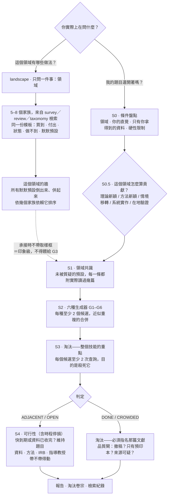

# research-gap-hunter — 給 LLM agent 的領域地形與論文題目淘汰 skill

[English](README.md) | **繁體中文**

一個用在「還沒有題目」那個階段的 agent skill。它分兩層，因為「我現在在哪裡」跟「這件事還開著嗎」是兩個問題，值得花的錢差很多。

**第一層 · `landscape` 領域地形——先把領域看清楚。** 便宜的定位。你只要給它一樣東西（領域），它回來的是這個領域現在有哪些做法家族，每一個都寫在同一份模板上：它是什麼、它**買到什麼**、它**付出什麼**、飽和了還是還在動、結構上做不到什麼、默默預設了什麼。最後把所有家族的默默預設全部倒出來、語意相同的併起來、依「幾個家族依賴它」排序——那張表叫**這個領域的牆**。它不淘汰任何做法，也不判任何做法新穎。

**第二層 · `hunt` 缺口獵捕——判斷什麼還開著。** 貴的判決。你叫語言模型「給我一個創新的論文題目」，它一定是在訓練分布內做內插，交出這個領域最順、最多人走、因此最可能已經被做過的那條路——這是機制問題，不是提示詞寫得不好。所以這一層不靠生成取得新穎性：它刻意大量產出候選，然後把全部力氣拿去用期刊檢索**殺掉**它們，最後只報告活下來的那幾個。要回答的就是一句話：**這個題目有人做過嗎？你說得出是哪一篇嗎？**

兩層只在一個地方接起來：第一層產出的那張牆表，正好就是第二層第 1 步要吃的東西。先跑第一層是走完第二層最省的路，而**只跑第一層就結束，也是一個正當的結局**。

由一個趕論文的碩士生打造，最初是為了自己用。技能本身是純文字規則，沒有執行程式、不需要金鑰、沒有任何東西要安裝。這個 repo 裡的 Python 全部是離線工具：格式查核器、倉庫與打包掃描器、樣本生成器、打包腳本——不論跑地形還是跑獵捕，一行都不會用到。

## 兩層，兩種證據標準

| | `landscape` 領域地形 | `hunt` 缺口獵捕 |
|---|---|---|
| 回答什麼 | 這個領域有哪些做法、各自買到什麼付出什麼、哪些飽和哪些還在動 | 這個題目還開著嗎、你說得出把它關掉的是哪一篇嗎 |
| 跟你收多少 | 一個問題，然後三輪家族推導檢索，加上每個家族一到三次 | 先答四個問題，再跑數十次檢索，每個候選都要被主動殺一次 |
| 產出什麼 | 領域地形報告，最後一節是**這個領域的牆** | 研究缺口報告：存活／待確認／已淘汰，外加逐字檢索紀錄 |
| 對引到的文獻做了什麼查核 | **完全不查** | 存在性、撤稿、發表型態，以及每一次擊殺背後的四項對齊 |
| 會不會說「沒人做過 X」 | 永遠不會——這是被禁止的措辭 | 永遠不會——只寫哪些查詢詞在哪些索引回傳了什麼 |

想要哪一種就直接講。分不出來時，技能會先問一句路由問題再花任何錢。

**兩邊的門檻為什麼不一樣，講實話。** 獵捕的舉證門檻高，是因為判決會被人拿去行動：一個 `DONE` 要摘要逐字引句**加上**母體／處理／結果變項／研究設計四項全中；一個 `CROWDED` 要三篇文獻各自對到你的一個子問題。這些門檻對判決是對的。它們對「定位」是錯的工具，而且這件事有數字：在一次**四輪實測**裡，**全部候選有 52% 最後落在「待確認」——也就是「我判不出來」。** 對判決來說那是誠實而站得住的結果，沒有任何東西被靜默丟掉；但對一個只想知道自己站在哪裡的人，一份有一半在聳肩的報告沒有用。

所以地形模式跑的是刻意較低的門檻，而**降的是舉證的量，不是誠實的標準**：每個家族 3–6 篇錨定文獻，代表性而非窮盡性；趨勢一律寫成「`<查詢詞>` 在 <索引> 回傳 X 筆，其中 <年份> 之後 Y 筆」，不寫「這個方向正在爆發」；某個家族查不動時，〈狀態〉直接標〔涵蓋不足〕然後**走人**——不追、不補搜、不默默升級成一個小調查。`verify`、`retract`、`snowball`、`fulltext` 全部不跑，因為這裡沒有任何東西被殺掉。

有兩條在任何一層、任何一階都不放寬：**不捏造引用**（每一筆錨定文獻都來自工具實際回傳值，作者、年份、標題照抄），以及**永遠不寫「不存在」**（只寫這次檢索回傳了什麼）。第二條在地形的〈結構上做不到〉那一欄最容易破功，所以那一欄被釘死成**這個做法本身的性質**——「它的輸出是相似度排序，本身不帶運動方向」——而文獻式的讀法被禁止：「沒有人用它做過方向估計」是斷言，不是觀察。

**地形模式唯一的硬性內容規則：一個家族只寫了買到什麼、沒寫付出什麼，就是描述不誠實。** 一個做法如果真的沒有代價，它早就把其他家族清光了。查不到代價沒關係，但要寫「還沒查到」——留白會被讀成「免費」，而那是一份地形報告能造成的最大誤導。

**兩層之間的橋，以及承接的來源規則。** 獵捕的第 1 步以前要一邊憑空生出「這個領域沒人質疑的預設」、一邊替每一條掛上沉重的量化取樣框——那是整個 skill 最容易被幻覺出來的欄位。有地形報告的時候，第 1 步改成**承接那張牆表**。承接進來的牆**不帶取樣框**（地形模式在定義上沒跑過），所以它要把來源寫在臉上：

> 預設 A3〔承接自地形 W3，支撐家族 F1、F4〕：〈一句話〉

它的效力**等同**〔印象，未驗證〕：可以讀、可以排序、可以用來決定往哪裡挖，**但不是 G3（預設反轉）的合法輸入**。真的要反轉其中一條，就**只對那一條**補跑取樣框，補完改標成〔承接自地形 W3，已補取樣框〕。這把成本結構整個倒過來了：預設是別人給的，你只替真的要反轉的那一兩條付檢索成本。還沒補框的承接預設同時**豁免於檢索紀錄互鎖**——它不是這一輪搜出來的，逼它附檢索紀錄等於逼報告去寫一次沒跑過的搜尋。它的標籤要保持原樣、不改寫成〔印象，未驗證〕：兩者效力相同，但讀者必須看得出這一條是別份報告帶進來的。

## 系統架構



三條規則貫穿獵捕的所有路徑：每一個淘汰都必須**指名殺死它的那篇文獻**；共識圖裡的每一條預設都必須附上**推導它時實際讀過幾篇**，而且要跟「為了推翻它而跑的那次檢索」的篇數分開記；每一個拿到新穎性判定的候選，都必須在**檢索紀錄裡找得到對應的那一列**，否則一律降級為未驗證並移進待確認那一節。

## 這個工具不做什麼

**如果你手上已經有兩個具體概念、只想知道這個交集有沒有人做過，請用 lit-review 的 `gap` 指令——兩三次查詢、幾分鐘就有答案，本工具在那裡沒有任何優勢。** 題目**選定之後**的所有事情也都是 lit-review 的本業：找參考文獻、查核引用、查撤稿、找全文、產 RIS 與 EndNote 匯入檔。那些在這裡是刻意不做。

**還有：你想知道的如果是「誰在這個領域發表」而不是「這個領域在怎麼做」，請用 lit-review 的 `map`。** 這是一條真的界線，不是命名上的計較，而且它現在是**兩邊都主張**的——這兩個 skill 已經撞過一次，而只有一邊主張的界線不是界線。本技能這一邊：`SKILL.md` 的 frontmatter 描述（叫路由把文獻層的問題送去 `map`），以及〈與 lit-review `map` 的分界〉那一段。lit-review 那一邊：它自己的 frontmatter 描述現在寫明 `map` 盤的是文獻、技術盤點要**指名交給**本技能的 `landscape`，同一條分界也寫進了 `lit-review/README.md`、`lit-review/USAGE.md` 的指令表，以及 `lit-review/references/grad-toolkit.md` 的 `map` 條目。兩邊都指名對方，也都寫明自己不接哪一半。至於**在本頁用兩種語言各寫一次**，那只是其中比較小的一半——同一邊講兩種語言，仍然只是一邊在講。分界本身是：**`map` 盤的是文獻**——奠基文獻是哪幾篇、關鍵作者是誰、近三年往哪走；**`landscape` 盤的是做法**——有哪些技術路線、每一種買到什麼付出什麼、大家共同預設了什麼。同一個領域兩份都想要非常合理，但它們**不是彼此的替代品**，也不該寫進同一份報告。另外要注意：`map` 是 lit-review 的**技能指令**，要載入 lit-review 才有，**不是** `lit_api.py` 的子指令——而本技能呼叫的正是那支腳本。

跟 `gap` 之間的界線是**階段**，不是誰比誰強。判準是：你開口的那一刻，候選在誰手上。

| 你實際上在問什麼 | lit-review | research-gap-hunter |
|---|---|---|
| 「這個領域有哪些做法？各自的取捨是什麼？」 | — | ✅ `landscape` |
| 「哪幾篇是經典？關鍵作者是誰？」 | ✅ `map` | 不在範圍——盤的東西不同 |
| 「X 與 Y 的交集有人做過嗎？」——X 與 Y 你已經講出來了 | ✅ `gap`，兩三次查詢、幾分鐘 | 殺雞用牛刀，不要啟動 |
| 「我根本還沒有題目」 | — | ✅ `hunt`：盤點 → 生成 → 淘汰 |
| 「我手上這個題目夠不夠新？」 | — | ✅ `hunt`，當成單一候選，直接進淘汰 |
| 產出你自己想不到的候選方向 | — | ✅ 六種結構性生成器 |
| 「這筆引用存在嗎？書目欄位對嗎？」 | ✅ | 完全不查，一次也不查 |
| 撤稿、全文、RIS／EndNote 匯出 | ✅ | 借用 lit-review 的腳本做存在性查核、撤稿、滾雪球與匯出 |
| 寫文獻回顧章 | ✅ | 刻意不做 |

兩條分流規則，一軸一條。**盤的東西：做法 → 本技能；文獻 → lit-review。** **階段：候選還不存在 → 本技能；候選已經指定 → lit-review。** 兩者不會在同一輪互搶，因為本技能是直接呼叫 lit-review 的**腳本**，而且淘汰步驟從不呼叫 `gap` 指令。（`gap` 只在最後允許用一次：存活候選定案之後的交棒階段，可以拿單一交集再壓一次力。）

## 兩種模式各自在做什麼

### `landscape`：進去一個問題，出來一張圖跟一份牆表

**入口。** 它需要領域。那是唯一必答的——獵捕的另外三個盤點問題與貢獻判準那一步**刻意不問**，因為問了就不便宜了，而這個模式的輸出不依賴它們。它另外會問你「你知道哪幾種做法」，這一題可以免費跳過；但你答得出來的通常就是實務上真的在用的那幾種，值得花三十秒。

**家族清單來自別人做好的分類，不來自印象。** 家族清單自己就是整個模式最容易被編造的一環，所以它必須有來源：`survey`／`review`／`taxonomy` 三種檢索各一輪，讀到 `brief` 的標題層，再 `pick` 幾篇讀摘要，直接抄回顧文獻**已經做好的分類**。目標 5–8 個家族。兩個家族如果〈付出什麼〉寫得一樣，它們就是同一個家族——這裡的單位是取捨，不是名字。

**這個模式到底要花多少次檢索，用數的、不用宣稱的。** 三輪家族推導檢索——`survey`、`review`、`taxonomy` 各一輪，家族清單的來源就是從這裡來的——再加上每個家族一到三次，另外每一道判成「已經有人在拆」的牆各要一次（那個值必須指名是誰在拆，指不出來就不合法）。第二、三次的家族查詢**不是可以花掉的定額**：只有第一次回傳太少、寫不出〈狀態〉那個句型，或者術語根本用錯的家族，才會需要它。拿 repo 裡兩份地形標本實際數出來：[`examples/landscape_example.md`](examples/landscape_example.md) 是**五個家族 9 次檢索**，`evals/fixtures/good_landscape.md` 是**七個家族 10 次**。要編預算就照這兩個數，不要照「家族數乘以每族次數」去算：`SKILL.md` 的〈兩種模式〉表到現在寫的還是「每個家族 2–3 次檢索」，而且完全沒把那三輪推導算進去，乘出來是五個家族 13–18 次、七個家族 17–24 次——接近任一份標本實際花費的兩倍。散文與標本不一致時，被真的跑過的是標本；而那份範例在它自己的附錄裡寫明了它在哪裡沒跑滿、以及為什麼。

**每個家族寫在同樣的八個欄位上**，讓家族之間可以互相比較，而不是各自用對自己最有利的說法描述自己：一句話 · 買到什麼 · **付出什麼** · 3–6 篇帶識別碼的錨定文獻 · 狀態（`飽和`／`活躍`／`新興`／`衰退`／`〔涵蓋不足〕`，前四個必須在同一欄掛上檢索證據）· 結構上做不到什麼 · 默默預設（每一條給一個像 `F3-b` 的編號）· 一個人的進入成本。

**然後兩份綜合。** 一份是「實際上怎麼疊」——實務上幾乎沒人單用一個家族，而疊起來之後成本常常落在沒有參與選擇的那個人身上；另一份是「能量在哪裡」，一律寫成檢索結果。最後是**牆表**：把每一條 `F<n>-<字母>` 倒出來、語意相同的併成一道牆、依**去重後的家族數**由多到少排序，每一道標成 `真的必要`／`歷史偶然`／`已經有人在拆`（第三個值必須指名是誰在拆並附識別碼，指不出名字就不合法）。第二節每一個預設編號都要落在恰好一道牆裡，牆表裡的每一個編號都要在第二節找得到——憑空多出來、上游沒有來源的牆，是這個模式最可能的編造，所以這道互鎖是精確的。

排序是這樣設計的，因為**這份清單是要被認出來的，不是被挑選的**。支撐家族最多的那幾道牆，通常就是你做過這個領域、心裡早有感覺卻講不出名字的那幾條；放在最前面你會直接點頭，埋在第七條你根本讀不到。

### `hunt`：盤點、生成，然後把全部預算花在殺

**第 0 步（條件盤點）**：四件事一次問完——領域與次領域；讀文獻時哪裡讓你皺眉；**你拿得到而別人拿不到的資料**；硬性限制（時間、經費、會用的方法、IRB、指導教授的紅線）。第三項是最大的單一槓桿，因為模型從沒看過你的資料。你不想回答也可以，但那一輪會明確降級，並寫出哪一個生成器因此沒跑——不會默默用通用假設補上。

**第 0.5 步（確認貢獻判準）**：不是每個領域都用文獻新穎性衡量貢獻。應用、臨床、設計、在職專班常常是用「在新的作業情境中複製並驗證」來衡量。判準是那個的時候，文獻密集就**不是**淘汰候選的理由。

**第 1 步（畫出領域共識）**：把沒有人在質疑的預設挖出來——大家都用的母體、大家都信的那份量表、時間尺度、預設的因果方向、分析層次、從沒被問過的邊界條件。**已經跑過地形報告的話，這一步直接承接那張牆表，不重盤一次**（來源規則見上面）。沒有的話就自己盤，每一條預設都要把樣本框分開寫：標題層掃描 `N` 篇（附查詢詞與 limit）、摘要層真的精讀 `M′` 篇、其中 `M` 篇沿用這條預設，再加上**另一次目的在於推翻它**的檢索回傳 `K′` 篇、讀後 `K` 篇確實檢驗過它。**`N` 不是 `M` 的分母**——那 N 篇的摘要根本沒讀過；`K` 來自另一次檢索，與 `N` 無關，也可以大於 `M′`。讀過的摘要不到三篇的預設一律標〔印象，未驗證〕，而印象不得餵給 G3。

**第 2 步（六種生成器）**：G1 負空間（誰從來沒被研究過）· G2 跨域移植（哪個學科解決過結構上同型的問題）· G3 預設反轉 · G4 矛盾獵捕（效果量互相打架、重現失敗）· G5 構念效度落差（宣稱在測 X，其實在測 Y）· G6 未被訓練過的資料（來自第 0 步）。每個候選都要寫成**可檢驗的陳述**，不能停在主題詞。目標是覆蓋而不是總數：每種生成器至少兩個、近似重複的在**給編號之前**就合併（編號一旦給出去，之後每一節都是一個編號一列，不再合併掉任何一個）、不適用的就寫「G*n* 不適用，因為……」而不是硬湊。

**第 3 步（淘汰）**：每個候選至少兩種查詢，而心態就是整個方法本身——**你是在搜尋殺死它的證據，不是在搜尋確認它的證據。**

| 判定 | 意思 | 報告裡必須有什麼 | 結果 |
|---|---|---|---|
| **DONE** | 已經有人做過同一件事 | 該篇文獻與識別碼、**摘要裡足以證明的那一句逐字引文**，以及母體／處理／結果變項／研究設計四項全中 | 淘汰 |
| **CROWDED** | 沒有完全相同，但這個問題已有大量文獻 | **至少 3 篇，逐篇寫明它涵蓋了你的哪一個子問題**；只要還有子問題沒人涵蓋，就不是 CROWDED | 淘汰 |
| **ADJACENT** | 鄰居有人做過，這一格是空的 | 最近鄰文獻與識別碼；差在哪一個維度、以及為什麼這個差異有理由造成不同結果；還要檢查那篇自己的限制與未來研究有沒有已經點名你這個缺口 | 存活 |
| **OPEN** | 兩種以上查詢都幾乎沒有命中 | 至少 3 次查詢，其中一次是換過術語的重搜；**換詞後找得到最近鄰時**再讀那篇自己的限制，真正完全空白的 OPEN 則在該欄逐字寫「不適用（無最近鄰）」，不得為了填欄位生出一個最近鄰 | 存活，但當成可疑訊號處理 |

第五種判定同樣存活，但不宣稱缺口：`INCREMENTAL` 代表有人做過類似的，但在你的處境下這樣做仍是正當的貢獻——此時的建議是**維持題目、改寫貢獻定位**，而不是去找替代方向。

上面那個「讀最近鄰自己的限制」是**唯一真的會改變判定的加值檢查**，而且幾乎免費——那篇你已經讀了。摘要裡看不到限制段落時，值得為它花一次 `fulltext` 或 OA 連結把那一段讀出來。相對地，**被引滾雪球是選用的**：它每跑一次就是一輪 API 加一輪閱讀，只在兩種情況下值回票價——最近鄰是三年以上的舊文獻，或它的限制段落根本讀不到。

**不是每個候選都拿得到判定，而報告替這件事留了位置。** 每個候選必定落在三節其中一節：存活（`ADJACENT`／`OPEN`／`INCREMENTAL`）、已淘汰（只有 `DONE` 與 `CROWDED`）、或**待確認（證據不足，尚未定案）**。待確認收的是：標題看起來很像但摘要沒讀到的（`DONE?`）、術語不明而不是真的沒人做的 `UNSEARCHABLE`、結構同型說不出怎麼被否證的 G2 移植、沒拿到全文的 G5 構念質疑、看到矛盾卻說不出機制的 G4、最近鄰自己的未來研究已經點名的〔已排隊〕、以及只有預印本命中的時間競賽風險。每一列都必須寫明**還缺哪一項證據、以及補齊它的具體動作**——重點就是不准有東西安靜消失。表頭固定寫上對帳式 `生成 N ＝ 存活 M ＋ 待確認 P ＋ 已淘汰 Q`；那是對帳，不是配額。上面引的那個 52% 就是從這一節來的，而它是高門檻誠實的代價。

**第 4 步（可行性過濾，含時程停損）**：停損先跑——期限已近、或資料已經收完，預設建議就是維持題目、改寫貢獻定位。技能製造出使用者負擔不起的轉向，那是造成傷害，不是完成工作。它帶一道守則：**時程未知就完全不跑這一段**——先問一句，仍不答就把「維持題目」寫成一個**預設值**，而不是拿沒有的資料演一次判斷。接著才是一般的過濾：資料、方法、IRB、期限，再加上兩件模型判斷不了、必須交還給你的事——指導教授帶不帶得動，以及口試委員會不會用你系所的語言接受這個貢獻。

**第 5 步（輸出）**：固定七節——共識圖與預設清單 · 附搜尋證據的存活候選 · 待確認候選與各自缺哪一項證據 · 每一列都附殺手文獻與識別碼的淘汰表 · 一週內做得到的下一步 · 逐字的檢索紀錄 · 可直接複製給 lit-review 查核的 DOI 清單。

## 快速上手

**Claude Code**：

```bash
git clone https://github.com/Zachariah9420/research-gap-hunter-skill- ~/.claude/skills/research-gap-hunter
```

目標資料夾必須叫 `research-gap-hunter`（skill 名），不是 repo 名。

然後直接說。要定位就說：「〈某領域〉現在有哪些做法？」「帶我看一下這個領域」「哪些做法已經做爛了？」——那是 `landscape`，只跟你收一個問題。要題目就說：「我想不出〈某領域〉的論文題目」或「我這個題目到底新不新」——那是 `hunt`，它會先跟你確認再開跑，因為完整跑一輪代表先回答四個問題、再跑數十次檢索。講得不清楚時，技能會先問你要哪一種，而不是往貴的那邊猜。

只想要獵捕的抽樣而不是普查的話直接講：單一候選的偵察模式是支援的，但它刻意是一個**明確較弱的產品**——1 個候選、2 次檢索、約五分鐘，而且**完全不輸出任何新穎性判定**，只給〔DONE?〕或〔待再查〕。報告會標明這是抽樣，要把其中任何一項升級成判定，必須回頭跑完整流程。

**Codex／其他 agent**：在 `AGENTS.md` 加一行：

> 要盤點一個領域有哪些做法，或要找研究題目、壓力測試題目時，請讀 `<clone路徑>/SKILL.md` 並照其流程執行。

沒有東西要安裝。`SKILL.md` 放的是兩種模式、判定表、誠實紀律與固定輸出格式；比較重的操作細節分在 [`references/`](references/) 兩份檔案，跑到那一步才讀。[`references/generators.md`](references/generators.md) 是 G1–G6，逐個寫明它欠什麼舉證、最常見的假陽性是什麼、舉證沒跑完時候選該落到哪一節。[`references/elimination-engine.md`](references/elimination-engine.md) 是可攜的 `lit_api.py` 路徑偵測、搜尋漏斗契約、各指令的判讀與坑、四階降級階梯、中文索引規則，以及交棒到 EndNote 的組檔步驟。降級階梯那張表是表頭〈文獻工具〉那一行的**唯一出處**，**兩種模式共用同一張表**——`SKILL.md` 裡以前另有一份複本，它跟正本對 Consensus 類 MCP 該算第幾階的看法不一致，已經刪掉。

## 選配：lit-review（建議安裝——淘汰站不站得住腳靠它）

本技能可以獨立使用，但判定的可信度就等於背後那些搜尋的可信度。環境裡有 **lit-review** 時，淘汰步驟才拿得到它自己做不到的機器查核：

```bash
git clone https://github.com/Zachariah9420/lit-review-skill ~/.claude/skills/lit-review
```

| 沒有 lit-review | 有的話 | 差別在哪 |
|---|---|---|
| 隨手讀摘要 | `search` → `brief` → `pick` | DONE 判定才引得出真的摘要原句，而不是靠標題像不像；地形模式從回顧文獻抄家族分類，靠的也是這一組 |
| 殺手文獻只是被宣稱存在 | `verify` | 回 `not_found` 就撤銷這次淘汰，候選復活 |
| 撤稿沒查 | `retract` | 被撤稿的文獻不該有資格殺死一個題目；零 LLM 成本，所以每一篇殺手都跑，不是抽樣 |
| 一篇預印本就能殺掉題目 | `versions` | 只有預印本命中時，DONE 降級為「有人在跟你賽跑」——那是時程風險，不是新穎性判死 |
| 「沒人做過」可能已經過期十八個月 | 讀最近鄰自己的限制段落，`snowball --direction citations` 當選用的後備 | 真正會翻掉判定的是限制段落；滾雪球只有在最近鄰太舊、或限制讀不到時才值回它的成本 |
| G4／G5 靠摘要硬講 | `fulltext` | 效果量與量表題項只存在於全文，摘要裡永遠沒有 |
| 淘汰理由消失 | `export-xml` | 某個方向為什麼被砍掉，會一起進 EndNote 的 Research Notes 欄——三個月後你就是去那裡找答案 |

兩個值得知道的細節。第一，本技能呼叫的是**腳本**（`lit-review/scripts/lit_api.py`，純 Python 3.8+ 標準函式庫），從不載入 lit-review 這個 skill 本身——所以沒有 token 成本，也不會觸發衝突。第二，偵測只在開頭跑一次，結果直接印在報告開頭，你隨時看得出某個判定是哪一層做出來的。落在哪一階同時決定**有幾個生成器跑得動**：第 1 步的量化取樣框是用 `brief` 與 `pick` 撐起來的，所以只有 web 搜尋的那幾階，預設一律只能標〔印象，未驗證〕，G3（預設反轉）因此沒有合法的輸入，只能寫「不適用」；G5 少了 `fulltext`，只有在你自己找到 OA PDF、而且真的讀到「方法—測量」段落時才跑得動。**那幾階照常跑得動的是六種裡的四種——G1、G2、G4、G6**——報告的〈降級聲明〉必須寫明這件事，而不是拿舉證根本拿不到的候選把清單湊滿。**另外，沒有 lit-review 時撤稿檢查也沒有便宜的替代品；報告會寫「撤稿檢查：未執行」，而不是暗示它通過了。** 地形模式降級得溫和得多，因為它不殺任何東西：低階時它的錨定文獻可能拿不到識別碼（照寫並標明），〈狀態〉的檢索句型改成實際跑的那個工具回傳了幾筆。

## 打包上傳（ChatGPT Skills 或分享給別人）

**clone 下來的資料夾不能直接壓縮上傳**：那樣會把 `.git` 目錄一起包進去，而且頂層資料夾名稱會是 repo 名而不是 skill 名。用這行產生正確的包：

```bash
python scripts/package_skill.py          # → research-gap-hunter.zip
```

它以 **`git ls-files`** 為清單，所以包的內容**就等於 clone 會拿到的東西**（不含 gitignore 的檔案、不含 `.git`、不含 `.env`）。這有一個一定要講清楚的後果：**還沒 commit 的檔案不在 `git ls-files` 裡，因此也不會進 ZIP**——這是刻意的（沒入庫的東西不該分享出去），但也代表你必須先 `git add -A && git commit` 再打包，否則交出去的會是一份缺件的 skill。腳本接著把結果包成 `research-gap-hunter/` 頂層資料夾讓 `SKILL.md` 落在平台預期的位置，最後自動跑 `evals/zip_check.py` 掃金鑰、個人 email 與本機絕對路徑。**檢查沒過會直接刪掉 ZIP 而不是交給你**——會外洩的包比沒有包更糟。

## 機器檢查得到的（與檢查不到的）

這裡的保證是什麼形狀，要先講清楚，因為它比 lit-review 弱，而且這個差別很重要。

```bash
python evals/format_check.py <報告.md>          # 產出的報告是否符合結構規則
python evals/format_check.py <報告.md> --json   # 同樣的結果，機器可讀
python evals/self_test.py                       # 57 個樣本，每個都必須落在它該落的 check id
python evals/mutation_test.py                   # 41 個突變體，證明每條規則真的是抓到它的那一條
python evals/make_fixtures.py --check           # 磁碟上的樣本沒有被手動改動過
python evals/doc_scan.py                        # 文件宣稱的 vs 倉庫實際有的
python evals/zip_check.py <zip>                 # 包裡沒有金鑰、沒有本機路徑、沒有 .git
```

**先講範圍的形狀，再講能力。** `format_check.py` 兩種報告都收，但收得不一樣，而這個不對等是刻意的。它看第一行決定用哪一套規則（`# 領域地形報告：` 對 `# 研究缺口報告：`，表頭〈模式〉那一行是備援判別點），而地形報告拿到的是一套**刻意很薄**的規則：`LHEAD-01`（報告要自己宣告它是什麼，並逐字帶上〈這份報告不做什麼〉那一行）、`LVOCAB-01`（不得出現任何新穎性判定詞彙——這是這個模式最可能發生的漂移）、`LCOST-01`（每個家族都要同時寫出買到什麼**與**付出什麼）、`LSTAT-01`（〈狀態〉必須是五個合法值之一，而其中四個是判斷、必須在同一欄掛上檢索證據）、`LWALL-01`（牆表與家族預設要雙向對得起來，〈家族數〉要去重）——外加跨模式共用的那幾條，包括 `LANG-01` 禁止斷言「不存在」。缺口報告那一大批規則在這裡多半沒有對象：這裡沒有結算、沒有判定、也沒有存活清單。

往地形疊更多規則，等於把這個模式當初就是為了避開的那道門檻原封不動搬回來，所以「薄」是設計不是待辦。它誠實的代價是：**一份地形報告受到的約束遠少於一份缺口報告**，而真正決定它有沒有用（而不只是格式漂亮）的那些事——家族切得對不對、那個代價是不是真的、那道牆是不是真的在承重——沒有任何程式在看，只有你。

守住這一頁的就是 `doc_scan.py`：規則條數它從 `format_check.py` 讀、樣本數從磁碟數、突變體數從 `mutation_test.py` 讀，只要 README 裡寫死的數字、檔案路徑、指令或相對連結跟倉庫對不上就回非零。下面每一個數字都在它的守備範圍內——寫錯會讓一次執行變紅，而不是安靜地留在文字裡。

`format_check.py` 是決定性的，不連網、成本為零。它宣告 **28 條規則**：上面那五條地形規則，加上缺口報告的二十三條。那二十三條實際強制的是這些：**看起來是報告結構的一部分、卻讀不進來的行或列，一律回報，不得靜默丟掉**——沒被讀進表的列（被 blockquote 包住、用了全形直線、或表格中間插了非表格的一行導致後面整批不再被讀）、欄數與表頭不符的列、認不出來的候選或家族標題、寫成解析不了的形狀的預設行、某一節說該有卻整張找不到的表，以及**被改寫過的區段標題（以前它會把底下每一條規則安靜地關掉）**；因為丟掉的那一行不會被任何規則檢查，而計數類的規則會把它顯示成算術對不起來，把作者送去改一個本來就對的數字；報告有沒有該有的區段、表頭有沒有宣告這一輪落在文獻工具的第幾階；宣告的存活數等不等於實際寫出來的候選區塊數、生成數有沒有小於存活數；**候選結算對不對得起來——生成 N ＝ 存活 M ＋ 待確認 P ＋ 已淘汰 Q，這三個數字各自要等於它指名那一節的實際列數，而且每一個候選編號只能出現在二／三／四其中一節一次**（這是整個 repo 唯一擋得住「候選在生成到報告之間安靜消失」的結構性防線）；每個判定是否在允許詞彙表內、存活清單裡有沒有混進不該存活的判定；**量化預設有沒有帶完整的分離取樣框（標題層掃描篇數、檢索詞與 limit、摘要層精讀 M′ 與 pick 索引、其中 M 篇沿用、另一次推翻性檢索回傳 K′ 讀後 K、樣本來源），且 M ≤ M′、K ≤ K′、M′ ≥ 3——湊不出來就必須標〔印象，未驗證〕，唯一的例外是承接自地形報告、還沒補取樣框的那一條（它免附框，而且保留自己的〔承接自地形 W…〕標籤）；G3 候選有沒有指名它反轉的是哪一條預設，而且那條既不得是印象級、也不得是還沒補框的承接預設**；每個存活候選的搜尋證據欄是否非空、非佔位符，且至少含一個可複製重跑的具體查詢詞；每個存活候選在檢索紀錄裡有沒有對應列，那些查詢詞欄是不是佔位符；被指名的最近鄰有沒有帶識別碼；每一列淘汰有沒有指名殺手文獻、那篇有沒有 DOI／arXiv／S2 識別碼；`DONE` 的淘汰原因有沒有摘要逐字引句；`CROWDED` 有沒有指名至少三篇；有沒有任何一行把「沒搜到」寫成「不存在」的斷言；以及宣告沒有檢索後端的那一輪，有沒有偷填任何判定。完整的規則表與「為什麼要有這條」在 [`evals/README.md`](evals/README.md)。

**為了那道橋新增的承接詞彙，其實非動查核器不可。** 本頁以前寫的是相反的話，而那句錯得值得攤開講，因為那道橋正是「分兩層」這件事的全部理由。舊說法有一半站得住：〔承接自地形 W…〕是第一節的**預設**標籤，不是候選狀態，所以判定、存活與待確認三組詞彙表確實都沒有變動。它漏掉的是：預設那一行有它自己的解析器，而那個解析器要求冒號**緊接在編號後面**。規格規定的每一種寫法都在編號與冒號之間插了來源標籤，所以承接來的預設一條都對不上——**它對查核器是隱形的**：既不會被算進去，也不會被檢查。而把這條路走到底（對其中一道牆補跑取樣框、改標成〔承接自地形 W3，已補取樣框〕、拿去餵 G3），查核器會用「G3 候選指到第一節沒有的預設」把一份**完全合規**的報告判成違規——叫讀者去找一條一直就在頁面上的預設。

後來實際落地的是：`ASSUM-01` 與 `ASSUM-02` 現在會讀那個來源標籤。**沒有**〔已補取樣框〕的承接預設不會被要求附取樣框——地形模式本來就沒跑過，要它補等於要它編一組數字——而它被擋在 G3 之外時，訊息會講明它是「承接來的、還沒補框」並指出補救動作（只對那一道牆補跑取樣框），不會說它不存在。**補了**〔已補取樣框〕之後，它與本輪量化的預設同一個標準，也就是 G3 的合法輸入。兩條分支都**不會**叫報告把標籤改寫成〔印象，未驗證〕：效力相同、來源不同，而表頭〈地形來源〉那一行存在的意義，就是讓讀者看得出哪幾條是別份報告帶進來的。檢索紀錄互鎖不受影響——`TRACE-01` 管的是候選，本來就沒管到第一節——所以未補框的承接預設在那裡是**構造上**就豁免的，不是靠一條特例。

上面那兩條路現在都有自己的樣本釘住了——一份只承接一道牆、維持未補框、查核器**不得**跟它要取樣框的報告，以及一份把整條路走完的報告（承接的牆補了取樣框，再由 G3 候選反轉）——它們兩側的兩種失敗也各有一份：標了〔已補取樣框〕但框缺欄位的（`ASSUM-01`），以及未補框卻照樣拿去餵 G3 的（`ASSUM-02`）。這四份原本一份都不存在，正是這一段錯這麼久的原因：整套測試從頭到尾都是綠的。

這個範圍裡有一件事它**沒有**檢查——寫在這裡是因為本 README 的舊版本兩個方向都寫錯過：它**不**檢查 `CROWDED` 那三篇是否各自對到**不同的子問題**。`KILL-02` 只數篇數，其他不管，所以三篇全部回答同一個子問題也會過，而你其餘的子問題根本沒人涵蓋——這條映射只活在文字規則裡，那三列請自己用眼睛讀過。另外兩句舊敘述則是錯在反方向：第一節的預設清單**有**被檢查（`ASSUM-01`），印象級預設**也的確**被擋在 G3 之外（`ASSUM-02`），兩條各有自己的樣本與突變體。查核器做不到的是判斷那些取樣框數字是不是真的——它只驗證這個框存在、內部一致，不驗證真假。

**它檢查的是報告的形式，它無法檢查裡面任何一筆引用是不是真的。** 一份完全捏造但格式漂亮的報告會通過。這句話仍然是這一頁最重要的一句——但它只是這條界線的一半，而另外一半現在已經量出來了：見下面的〈[天花板](#天花板形式只在解析器認得的形狀之內查得動)〉。

`self_test.py` 拿 57 個樣本跑這個查核器——十二份必須是綠的（一份完整報告、一份降級（無檢索）報告、一份括號態報告、一份被包在教學文件裡的報告區塊、一份部分檢索的報告用來釘住「沒搜過的候選豁免於檢索紀錄互鎖」、一份另行手寫的報告用來釘住中文索引的「不適用」值、一份乾淨的地形報告，再加上兩份專門釘那道橋的——一份承接了兩道牆的缺口報告（一條沒補框、一條補了框並被 G3 候選合法反轉），以及一份只承接一道牆、而那道牆維持未補框、查核器**不會**跟它要取樣框的最小報告；再加兩份釘住「SKILL.md 自己顯示得出來、解析器卻讀不到」的預設行形狀——一份用引用區塊開頭、一份把來源標籤與補框標籤寫成兩個相鄰的括號，兩種以前都是靜默丟掉的），加上每條規則各一份刻意弄壞的報告（少數規則不只一份，因為那個分支真的是另一條路）——其中 [`evals/fixtures/assumption_prose_mention.md`](evals/fixtures/assumption_prose_mention.md) 是一個**刻意的假紅燈**：一句只是在講兩條預設的散文被報成讀不到，而它被刻意留成紅的，因為能讓它閉嘴的那份寬容，正是當初讓破折號溜過去的那份寬容——逐一比對它該報出的 check id 集合、比對人類可讀模式與 `--json` 的 exit code 是否一致，並斷言**每一條宣告的規則都要有自己的樣本**，讓某條規則不會安靜地從沒被測過。它同時重跑一次 `make_fixtures.py --check`：被手動改到壞掉第二個維度的樣本會讓整個套件失敗，而不是安靜地讓別條規則看起來有被測到。`mutation_test.py` 再把每條規則的**條件**在一份拋棄式的副本裡削弱，確認它的樣本因此不再被抓——這才證明你以為在守門的那條規則，真的就是抓到它的那一條。這是**查核器的自我測試，不是行為回歸測試**：lit-review 能凍結行為是因為它有生產程式碼可以凍結，本技能連 runtime 都沒有。它的正確性活在一份「模型願意照著做」的文字規則裡，而這裡的測試碰不到那一層。

**已在真實材料上跑過**：**獵捕跑過四輪實測，上面那個 52% 待確認率就是從那裡來的，這一版有四項設計修改也是它給的證據。但它從來沒有在一次真人會照著行動的找題目情境裡完整跑完，而 `landscape` 完全沒有實測資料。** 技能裡多數規則仍然來自對設計的對抗式審查，不是來自觀察到的失敗；下面那張領域適用性表也是推理，不是量測。這就是它今天誠實的狀態，請把它讀成邊界，不是謙虛。

## 天花板：形式只在解析器認得的形狀之內查得動

上面那句承諾原封不動，而且仍然成立：**形式查得動，真假查不動。** 三輪對抗式作業補上的是這條界線的另一半，而它比第一句話聽起來窄：

**形式只在解析器認得的形狀之內查得動。一行寫成解析器不認得的形狀，就可能被靜默略過——而靜默跟通過長得一模一樣。**

這不是抽象說法，所以下面直接放兩份真的重現，而不是重現的描述。

**一列表格掉了行首那根直線。** [`evals/fixtures/glance_row_lost_pipe.md`](evals/fixtures/glance_row_lost_pipe.md) 是一份其他地方都完好的地形報告，只有一眼表的 `F1` 那一列少了行首那一個 `|`。一個字元。解析器只把「以直線開頭」的行餵進表，而它那個「這一行看起來像沒進表的列」的偵測器也一樣錨在行首——於是那一列既不進表、也不會被回報成讀不到；又因為它剛好是**第一列**，整張表連斷都不會斷。把那一列的〈付出什麼〉留白、〈狀態〉填上非法值，`LCOST-01`／`LSTAT-01` 就從兩個紅燈變成完全沉默：刪一個字元換一次假綠燈。拿遠端目前出貨的那一版（`ae49233`）跑 `python evals/format_check.py evals/fixtures/glance_row_lost_pipe.md`，離開碼是 0；工作目錄這一版抓得到。

**一條預設行改用破折號當分隔符。** 拿一份乾淨的報告，把它的預設行從 `- 預設 A2：〈…〉` 改寫成 `- 預設 A2——〈…〉`。以 `evals/fixtures/good_nosearch_report.md` 為例，查核器當時回報的是：讀到的預設 **0** 條（前一刻它每一條都讀得到）、讀不到的行 **0**、findings **0**、**離開碼 0**。畫面上沒有任何一句話說有一行沒被讀。兩個樣式都對不上：嚴格的那個只收 `：`、`:`、`｜`、`|` 當分隔符；而那個寬鬆的「看起來是預設、卻解析不出來」偵測器——它存在的全部意義就是讓一條寫壞的預設**報出來而不是消失**——在第三輪被加上了一個要求同一組字元的 lookahead，加它是為了讓它別再對「- 預設 A1 與 A2 都與量測方式有關」這種**在講**那兩條預設的散文亮紅燈。也就是說：一個為了修假紅燈而做的修正，把第二輪那條規則當初要堵的那個假綠燈原封不動買了回來。在真的有 G3 候選的報告上離開碼會是 1，但那是意外，而且訊息是錯的——「G3 候選指到第一節沒有的預設 A1」會把讀者送去找一條從頭到尾就在頁面上的預設行。

**這一個現在補起來了，而補的方式正是下面那條原則長出來的樣子。** lookahead 已經拿掉；[`evals/fixtures/assumption_em_dash_separator.md`](evals/fixtures/assumption_em_dash_separator.md) 把破折號釘住，而我們拿去試的其他分隔符——空白、箭頭、等號、句號、逗號、連字號——現在也一律報 `ASSUM-01`。代價付在另一個方向，而且在測試套件裡看得見：[`evals/fixtures/assumption_prose_mention.md`](evals/fixtures/assumption_prose_mention.md) 以前是一份**必須綠**的樣本，現在是一份**必須紅**的樣本。查核器現在會對一句完全沒問題、只是**在講**那兩條預設的散文亮紅燈——而那個煩人，就是「絕不丟掉一條寫壞的預設」被接受的價格。

**這一類本身沒有被關掉。** 下面這個實例今天就重現得出來，而且它不是打錯字，是最普通的措辭漂移——正是解析器的寬容當初要吸收的那種東西。兩個樣式都認死「預設」這兩個字。同樣的行改寫成「前提 A1：…」「假設 A1：…」或「Assumption A1: …」，在 `evals/fixtures/good_nosearch_report.md` 上你會再次拿到：預設 **0**、讀不到的行 **0**、findings **0**、**離開碼 0**。在有 G3 候選的報告上則是離開碼 1，配上跟前面同一句會把人帶錯路的訊息。

**這一類每一輪都被收窄，也每一輪都被重新打開。** 第一輪：承接進來的預設行被靜默丟掉。第二輪：被引用區塊包住的行，以及兩個相鄰的括號標籤。第三輪：掉了行首直線的列，以及靠**節標題文字**定位的規則——改一個節名就把它底下整批規則關掉。第四輪：破折號。這些每一個都修好了、都有自己的樣本、也都有突變體；而每一次修好之後，下一個對抗者又找到另一種形狀。它誠實的形狀就是這樣：「寬到讓一份散文規格的自然變異都能過」與「絕不對讀不到的行保持沉默」之間的那條界線，被每一個補丁**搬動**，而不是被移除。

**假紅燈和假綠燈不是一樣糟，而這個 repo 已經把它做反過一次。** 假紅燈的代價是讀者五分鐘的困惑：他去看那一行、看不出問題，然後不是去修查核器就是直接無視它。假綠燈是查核器對一份它根本沒讀過的文件回報成功，而讀者沒有辦法察覺，因為畫面上根本沒有東西可以被察覺。兩者衝突的時候，**選假紅燈**。第三輪那個 lookahead 是往反方向換的——它消掉一個五分鐘的煩人紅燈，換回一個看不見的失效——而它賠掉的正是第二輪之所以存在的那條規則，而且整段期間每一套測試都是綠的。那就是它的代價，也是為什麼這個取捨現在被寫成一條規則，而不是每次臨場再決定一次。

**現在在做什麼，只講方向、不當承諾。** 診斷是：矛盾在做法本身，不在任何單一補丁。用正規表示式解析散文，同時被要求**寬容**（SKILL.md 是散文、模型的措辭會漂、動不動就亮紅燈的查核器會被關掉）與**永不靜默**（丟掉一行就是假綠燈），這兩件事不可能同時最大化，所以每個補丁都只是把界線搬到別的地方。目前的方向是：不再從散文形狀去推結構，而是要求報告裡**要被機器檢查的那些部分**落在一個明確劃界、帶鍵名的區塊裡——這個格式對此已經有一個先例，就是 `<!-- format-check: report-start -->` 那道圍欄——讓一行的處境只有兩種：在區塊內，那它要嘛解析得到、要嘛報錯；在區塊外，那它**看得出來**沒有被檢查。這等於把靜默略過換成一條看得見的界線。它還沒做出來，沒有時程，而且它自己有真實的代價：格式愈硬，語言模型愈難照著寫，而那正是當初把解析器推向寬容的同一股壓力。在它出現之前，天花板就是這裡寫的這個高度。

**這些都不代表這個查核器沒有價值，也不該被這樣讀。** 28 條規則每一條都有自己的樣本釘住；每一條都有一個突變體證明——把規則的條件削弱之後，它的樣本就不再被抓到；57 個樣本整批跑起來是綠的。它當初就是為了那些**誠實的錯誤**而做的：結算對不起來、`DONE` 沒有逐字引句、存活候選在檢索紀錄裡找不到對應列、宣告沒有檢索後端卻照樣給判定、家族只寫了買到什麼沒寫付出什麼——這些它每一次都抓得到，而那些正是作者真的會犯的錯。一次綠燈的意思是：**看得到這份報告的規則裡，沒有任何一條抓到缺陷。** 這件事有價值，而且它跟「這份報告是乾淨的」不是同一句話。這一頁不會印出第二句。

## 設計原則

- **假紅燈與假綠燈衝突時，選假紅燈**：一行被誤報的代價，是讀者五分鐘的困惑；一行被靜默略過的代價，是整個保證——因為一個對它沒讀過的文件回報成功的查核器是在說謊，而畫面上沒有任何東西會講出來。這一條之所以被寫成原則，是因為這個 repo 已經往錯的方向最佳化過一次——見〈[天花板](#天花板形式只在解析器認得的形狀之內查得動)〉。
- **先看清領域，再決定什麼還開著**：定位與判決是兩個產品、兩種價格，把它們壓成一個，等於逼所有只想要一張地圖的人去付一場審判的錢。本技能的上一版正是這樣。
- **每一筆取捨都要兩面都寫**：一個家族只寫了買到什麼、沒寫付出什麼，就是描述不誠實；查不到就寫「還沒查到」，不准留白。
- **淘汰而不是生成**：語言模型產出的「新穎」，是這個領域最多人走的那條路換一組詞。撐過二十次擊殺嘗試還活著的那個，才有價值。
- **每一個淘汰都要指名殺手**：DONE 指名一篇並引出那句話，CROWDED 指名三篇並寫明各自涵蓋哪個子問題。**沒有存活數配額**——存活幾個就是幾個。存活很多代表「檢索覆蓋可能不足」，不代表「要再更用力殺」。
- **殺死一個候選要跟宣稱新穎一樣嚴**：假的 OPEN 會自我修正——你繼續讀、指導教授懂這個領域、那篇文獻遲早會浮出來。假的 DONE 則是安靜而永久的：它在報告裡看起來像一個乾淨的結論，然後那個題目就再也沒有人翻開。
- **預設要嘛交代樣本框，要嘛交代來源**：掃過幾篇標題、真的讀過幾篇摘要、其中幾篇沿用這條預設，以及另外那次「為了推翻它」的檢索回傳幾篇；寫不出來就標為印象，或標為承接自地形報告——兩種都不得餵給 G3。預設清單是整輪流程裡最像洞見、也最容易被幻覺出來的產物，所以查核器確實會盯這個框——它必須存在、而且內部一致（M ≤ M′、K ≤ K′、M′ ≥ 3）——但沒有任何查核器有辦法告訴你那些數字是真的。那一段是你的事。
- **「我沒搜到」是搜尋結果，永遠不是「不存在」的斷言**：每個 OPEN 都要寫成「在哪些索引、用哪些查詢詞、哪一天，得到的結果」；地形模式的〈結構上做不到〉講的也永遠是方法的性質，不是文獻的空白。
- **檢索紀錄就是報告本身**：紀錄裡沒有對應列的候選拿不到新穎性判定——標為未驗證、移進待確認那一節，繼續留在檯面上。少了這一條，其他所有誠實規則都只是自我宣告。
- **可行性是新穎性的一部分**：系上沒有人帶得動的題目，可行性等於零——而且愈新穎，愈可能正好踩到這一條。
- **絕不製造使用者負擔不起的轉向**：對一個兩個月後就要交、資料早就收完的學生，正確的輸出是「你的題目是增量，這在碩論是正當的選擇，我們把力氣放在怎麼誠實講清楚它的貢獻」，而不是六個替代方向。而時程未知時這條規則根本不會啟動——拿沒有的資料演一次停損，是表演。

## 領域適用性（推測，不是實測）

**這是推測而非實測**：跟 lit-review 那張表不一樣，沒有任何一個 session 真的拿這個技能跑過這些領域的文獻。以下是從設計推理出來的——正是這個技能自己會標成〔印象，未驗證〕的那種宣稱。它寫在這裡，是因為這些失效模式是結構性的、可以預期，不是因為它們被觀察到過。

| 領域 | 預期站得住 | 預期會失效或誤導 |
|---|---|---|
| **CS／AI／英語系工程領域** | 設計的主場：文獻是英文、被索引、有 DOI、摘要充足，而且技術家族有明確的名字也有人做過分類——那正是 `landscape` 賴以運作的東西 | — |
| **應用／臨床／設計／實務導向** | G1、G2、G6 仍然產得出可用候選；`landscape` 在這裡常常比 `hunt` 好用，因為「有哪些做法、各自的代價」是這類文獻答得很好的問題 | 「缺口＝價值」這個前提不成立。文獻密集是「值得在你的新情境裡檢驗」的理由，不是放棄的理由——所以一輪跑完回來十五個 CROWDED，技術上可能完全正確，實務上完全錯誤。第 0.5 步沒把貢獻判準設對，整輪就是校準到錯的靶 |
| **台灣在地／華語／單一機構** | 條件盤點、生成器、可行性過濾都正常運作 | 淘汰不行。既有研究躺在 NDLTD、華藝與 TCI，而本技能查不到它們——見下面的限制 |
| **數學／理論科學** | `landscape` 在這裡沒有被擋住——盤點證明技術、寫清楚每一種買到什麼，是正當的描述，而這個模式不下任何判定 | `hunt` 必須拒絕。這裡的新穎性是「這個命題還沒被證明」，期刊關鍵字檢索無法建立這件事；此時應該把你指向 zbMATH／MathSciNet 與該領域的人。給出一個撐不住的判定，比承認工具不適用糟得多 |

## 誠實的限制

在你依照本技能的任何判定行動之前，先讀這一節。

- **`landscape` 什麼都沒驗證，而且它自己的報告在第一頁就這樣寫。** 它不查文獻存不存在、有沒有被撤稿、是不是預印本；它不判新穎性；它永遠不宣稱某個做法沒有人試過。它的表頭有一行固定句專門講這件事，因為一份排版整齊的地形圖非常容易被讀成新穎性結論。錨定文獻是代表性的、不是普查：三到六篇讓一個家族被找得到，它們不證明關於這個家族的任何事。查不動的家族標〔涵蓋不足〕、就讓它空著——那個空格是資訊，把它填滿意味著要編出第三筆錨定文獻。
- **技能沒辦法「注意到某件事不對勁」，只有你可以。** 察覺某個發現跟你在實務上看到的不一樣、某個結論怪怪的、大家都用同一種方式量測而這件事一直讓你不舒服——這個動作模型做不到。技能能做的是把**你已經有的**那個直覺快速壓力測試，或者——在 `landscape` 這一層——把整個領域共用的預設攤在你面前，讓一個你講不出口的直覺變成一個你指得出來的東西。你沒有帶直覺來，兩種模式一樣會跑完，結果會結構完整而價值低很多。
- **只用英文搜尋會系統性低估在地性與華語文獻。** 預設用英文是因為期刊索引以英文為主，但題目一旦界定在台灣、華語語料、在地法規或單一機構，既有研究就躺在 NDLTD、華藝與 TCI——而本技能對這三個庫**完全沒有存取能力**，裝不裝 lit-review 都一樣。對這類題目只搜英文會得到接近零命中，而判定表會把它映射成 OPEN，那就是製造出來的假新穎。這是硬邊界不是粗糙處：報告必須寫明中文索引未檢索，而你必須自己去查過，才能相信那個 OPEN。
- **摘要層的淘汰無法判定 G4 與 G5 的候選。** 矛盾獵捕需要調節變項、納入條件與分析選擇，才解釋得了兩份研究**為什麼**打架；構念效度的宣稱需要量表的題項文字，那只存在於測量段落，摘要裡永遠沒有。這兩個生成器的候選一律排除在存活清單之外、不給新穎性判定，改進待確認那一節，並寫明它卡在哪裡、以及什麼動作能把它解開——因為對整批文獻的基礎做出一個自信而錯誤的宣稱，是這個技能可能產出的最糟結果，而把候選安靜地弄不見是第二糟。
- **「查不到」是搜尋結果，永遠不是「不存在」的斷言。** 搜不到最常見的原因是查詢詞用錯，不是那一格真的空著。真正沒人碰過的問題很罕見，而且真的碰到時，往往意味著這個領域認為它不重要——那是另一種你仍然得自己衡量的風險。
- **跨域移植（G2）在定義上搜不到自己。** 一個把生態學方法搬進組織研究的候選，不會被索引在你會給它的那個名字底下，所以它容易以技術性理由存活，而真正的既有研究正躺在目標領域自己的術語底下。它同時也是聽起來最聰明的那一種產出。所以它的舉證責任比別的生成器**更重**，不是更輕。
- **地形圖的牆是起點，不是證據。** 承接進獵捕之後，它們在構造上就是印象級的效力，單靠它們反轉不了任何預設；要把其中一條變成判定站得住的東西，就得對**那一條**付取樣框的成本。這道橋替你省下的是「替你根本不會用到的預設掛框」，不是「替你真的要用的那一條掛框」。
- **一行寫成解析器不認得的形狀，可能一聲不吭地被略過，而三輪對抗式測試沒有把這一類關掉。** 第三輪的樣本 [`evals/fixtures/glance_row_lost_pipe.md`](evals/fixtures/glance_row_lost_pipe.md) 就是一整列表格因為少了一個 `|` 而消失；而把一條預設行的分隔符從 `：` 改成 `——`，到今天仍然對「應該看得到它」的那兩個樣式同時隱形，離開碼 0、什麼都不報。這一類每一輪被收窄、也每一輪被重新打開，所以請把一次綠燈讀成「看得到這份報告的規則都沒抓到缺陷」，而不是「這份報告被讀過了」。完整的交代（包括現在正在往哪個方向做）在〈[天花板](#天花板形式只在解析器認得的形狀之內查得動)〉。
- **這裡的誠實靠的是文字紀律，不是行為回歸測試。** lit-review 能用 74 個凍結案例守住它的承諾，因為它有生產程式碼可以守。本技能沒有 runtime，所以 `evals/` 凍結的是**查核器**，不是技能本身：`format_check.py` 只檢查一份報告有沒有該有的**形狀**，`self_test.py`／`mutation_test.py` 也只證明這個查核器還在做它宣稱的事。一份報告可以滿足所有結構規則而內容完全是編的——而地形報告被要求的形狀又比缺口報告薄得多，那是刻意的。如果某一輪宣告「沒有可用的檢索後端」卻照樣給出自信的判定，那就是它的失效模式——`TIER-01` 擋得住這一種，其餘的要靠檢索紀錄讓你自己抓。
- **在真實使用中被驗證過的幾乎沒有。** 有四輪實測的獵捕，這一版好幾條規則因此被砍掉、降級或改寫；但沒有觀察過任何使用者透過它選定題目，沒有任何一個判定事後被拿去對照文獻裡真正有什麼，而 `landscape` 一次實測都沒有。
- **它無法告訴你指導教授願不願意帶、口試委員買不買單。** 這兩個限制決定一個題目可不可行的頻率，至少跟新穎性一樣高，而兩者都是刻意交還給你，不是靠猜。

## 範例

兩份範例都是教學用的產物，**書目全部是編造的**，每一份開頭都有一段擋不住的警語，逐條寫明每一筆假引用是怎麼被標記的。兩份檔案裡的任何一筆都不得被引用，也不要拿去餵 `retract`。

[`examples/landscape_example.md`](examples/landscape_example.md) — **短的那一份**，室內定位的地形走查：五個技術家族，其中一個刻意標成〔涵蓋不足〕，用來示範這個模式該在哪裡收手而不是回頭補洞；最後一張牆表五列，每一個編號都追得回某個家族。它的報告本體跟長的那一份一樣有圍欄，`python evals/format_check.py examples/landscape_example.md` 跑出來是 exit 0；文末的附錄逐項寫明每一段在示範哪一條規則。

[`examples/worked_example.md`](examples/worked_example.md) — 長的那一份，一次附答案的獵捕：必須被淘汰、且要引出摘要原句並指名殺手的候選；一個真正在地界定的台灣題目（必須觸發中文索引例外，而不是回一個假的 OPEN）；一個假 OPEN 被術語校正後推翻的候選；以及**兩個應該存活的候選**——一個 ADJACENT、一個 INCREMENTAL。自己拿它試跑，看是不是都落在該落的地方。

它是一份**把報告片段夾在解說裡的教學走查**，不是一份乾淨的報告檔：它會為了論證而引用被禁止的措辭，也在各節之間插進說明。所以它把中間那份報告用 `<!-- format-check: report-start -->` 與 `<!-- format-check: report-end -->` 圍起來，`format_check.py` 只讀圍欄之內的內容：這個檔今天跑出來是 exit 0，而且 `self_test.py` 要求它一直是綠的——改壞裡面那份報告會讓整個套件變紅。圍欄之外的教學文字是刻意不查的；圍欄之內則一條規則都沒有放寬，`LANG-01` 也一樣，理由見 [`evals/README.md`](evals/README.md) 〈Narrative documents — the report block〉：光是「我在引用」不構成豁免。完全被機器查核的標本是 [`evals/fixtures/`](evals/fixtures/) 底下那些樣本，而那些樣本的書目全是合成的，任何一筆都不得被引用。

---

MIT License。歡迎 Issue 與 PR。
