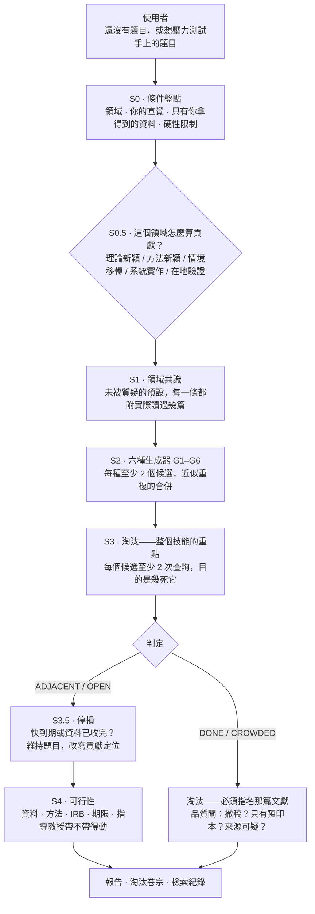

# research-gap-hunter — 給 LLM agent 的論文題目淘汰 skill

[English](README.md) | **繁體中文**

一個用在「還沒有題目」那個階段的 agent skill。你叫語言模型「給我一個創新的論文題目」，它一定是在訓練分布內做內插，交出這個領域最順、最多人走、因此最可能已經被做過的那條路——這是機制問題，不是提示詞寫得不好。所以這個技能不靠生成取得新穎性：它刻意大量產出候選，然後把全部力氣拿去用期刊檢索**殺掉**它們，最後只報告活下來的那幾個。整份報告要回答的就是一句話：**這個題目有人做過嗎？你說得出是哪一篇嗎？**

由一個趕論文的碩士生打造，最初是為了自己用。技能本身是純文字規則，沒有執行程式、不需要金鑰、沒有任何東西要安裝。這個 repo 裡的 Python 全部是離線工具：格式查核器、倉庫與打包掃描器、樣本生成器、打包腳本——獵捕的過程中一行都不會跑到。

## 系統架構



三條規則貫穿所有路徑：每一個淘汰都必須**指名殺死它的那篇文獻**；共識圖裡的每一條預設都必須附上**推導它時實際讀過幾篇**，而且要跟「為了推翻它而跑的那次檢索」的篇數分開記；每一個拿到新穎性判定的候選，都必須在**檢索紀錄裡找得到對應的那一列**，否則一律降級為未驗證並移進待確認那一節。

## 這個工具不做什麼

**如果你手上已經有兩個具體概念、只想知道這個交集有沒有人做過，請用 lit-review 的 `gap` 指令——兩三次查詢、幾分鐘就有答案，本工具在那裡沒有任何優勢。** 題目**選定之後**的所有事情也都是 lit-review 的本業：找參考文獻、查核引用、查撤稿、找全文、產 RIS 與 EndNote 匯入檔。那些在這裡是刻意不做。

界線是**階段**，不是誰比誰強。判準是：你開口的那一刻，候選在誰手上。

| 你實際上在問什麼 | lit-review `gap` | research-gap-hunter |
|---|---|---|
| 「X 與 Y 的交集有人做過嗎？」——X 與 Y 你已經講出來了 | ✅ 兩三次查詢、幾分鐘 | 殺雞用牛刀，不要啟動 |
| 「我根本還沒有題目」 | — | ✅ 盤點 → 生成 → 淘汰 |
| 「我手上這個題目夠不夠新？」 | — | ✅ 當成單一候選，直接進淘汰 |
| 產出你自己想不到的候選方向 | — | ✅ 六種結構性生成器 |
| 「這筆引用存在嗎？書目欄位對嗎？」 | ✅ | 完全不查，一次也不查 |
| 撤稿、全文、RIS／EndNote 匯出 | ✅ | 借用 lit-review 的腳本做存在性查核、撤稿、滾雪球與匯出 |
| 寫文獻回顧章 | ✅ | 刻意不做 |

一句話分流：**候選還不存在 → 本技能；候選已經指定 → lit-review。** 兩者不會在同一輪互搶，因為本技能是直接呼叫 lit-review 的**腳本**，而且淘汰步驟從不呼叫 `gap` 指令。（`gap` 只在最後允許用一次：存活候選定案之後的交棒階段，可以拿單一交集再壓一次力。）

## 功能

**第 0 步（條件盤點）**：四件事一次問完——領域與次領域；讀文獻時哪裡讓你皺眉；**你拿得到而別人拿不到的資料**；硬性限制（時間、經費、會用的方法、IRB、指導教授的紅線）。第三項是最大的單一槓桿，因為模型從沒看過你的資料。你不想回答也可以，但那一輪會明確降級，並寫出哪一個生成器因此沒跑——不會默默用通用假設補上。

**第 0.5 步（確認貢獻判準）**：不是每個領域都用文獻新穎性衡量貢獻。應用、臨床、設計、在職專班常常是用「在新的作業情境中複製並驗證」來衡量。判準是那個的時候，文獻密集就**不是**淘汰候選的理由。

**第 1 步（畫出領域共識）**：把沒有人在質疑的預設挖出來——大家都用的母體、大家都信的那份量表、時間尺度、預設的因果方向、分析層次、從沒被問過的邊界條件。每一條預設都要把樣本框分開寫：標題層掃描 `N` 篇（附查詢詞與 limit）、摘要層真的精讀 `M′` 篇、其中 `M` 篇沿用這條預設，再加上**另一次目的在於推翻它**的檢索回傳 `K′` 篇、讀後 `K` 篇確實檢驗過它。**`N` 不是 `M` 的分母**——那 N 篇的摘要根本沒讀過；`K` 來自另一次檢索，與 `N` 無關，也可以大於 `M′`。讀過的摘要不到三篇的預設一律標〔印象，未驗證〕，而印象不得餵給 G3。

**第 2 步（六種生成器）**：G1 負空間（誰從來沒被研究過）· G2 跨域移植（哪個學科解決過結構上同型的問題）· G3 預設反轉 · G4 矛盾獵捕（效果量互相打架、重現失敗）· G5 構念效度落差（宣稱在測 X，其實在測 Y）· G6 未被訓練過的資料（來自第 0 步）。每個候選都要寫成**可檢驗的陳述**，不能停在主題詞。目標是覆蓋而不是總數：每種生成器至少兩個、近似重複的在**給編號之前**就合併（編號一旦給出去，之後每一節都是一個編號一列，不再合併掉任何一個）、不適用的就寫「G*n* 不適用，因為……」而不是硬湊。

**第 3 步（淘汰）**：每個候選至少兩種查詢，而心態就是整個方法本身——**你是在搜尋殺死它的證據，不是在搜尋確認它的證據。**

| 判定 | 意思 | 報告裡必須有什麼 | 結果 |
|---|---|---|---|
| **DONE** | 已經有人做過同一件事 | 該篇文獻與識別碼、**摘要裡足以證明的那一句逐字引文**，以及母體／處理／結果變項／研究設計四項全中 | 淘汰 |
| **CROWDED** | 沒有完全相同，但這個問題已有大量文獻 | **至少 3 篇，逐篇寫明它涵蓋了你的哪一個子問題**；只要還有子問題沒人涵蓋，就不是 CROWDED | 淘汰 |
| **ADJACENT** | 鄰居有人做過，這一格是空的 | 最近鄰文獻與識別碼；差在哪一個維度、以及為什麼這個差異有理由造成不同結果；還要檢查那篇自己的限制與未來研究有沒有已經點名你這個缺口 | 存活 |
| **OPEN** | 兩種以上查詢都幾乎沒有命中 | 至少 3 次查詢，其中一次是換過術語的重搜；**換詞後找得到最近鄰時**再對那篇跑一次被引查核，真正完全空白的 OPEN 則在該欄逐字寫「不適用（無最近鄰）」，不得為了填欄位生出一個最近鄰 | 存活，但當成可疑訊號處理 |

第五種判定同樣存活，但不宣稱缺口：`INCREMENTAL` 代表有人做過類似的，但在你的處境下這樣做仍是正當的貢獻——此時的建議是**維持題目、改寫貢獻定位**，而不是去找替代方向。

**不是每個候選都拿得到判定，而報告替這件事留了位置。** 每個候選必定落在三節其中一節：存活（`ADJACENT`／`OPEN`／`INCREMENTAL`）、已淘汰（只有 `DONE` 與 `CROWDED`）、或**待確認（證據不足，尚未定案）**。待確認收的是：標題看起來很像但摘要沒讀到的（`DONE?`）、術語不明而不是真的沒人做的 `UNSEARCHABLE`、結構同型說不出怎麼被否證的 G2 移植、沒拿到全文的 G5 構念質疑、看到矛盾卻說不出機制的 G4、最近鄰自己的未來研究已經點名的〔已排隊〕、以及只有預印本命中的時間競賽風險。每一列都必須寫明**還缺哪一項證據、以及補齊它的具體動作**——重點就是不准有東西安靜消失。表頭固定寫上對帳式 `生成 N ＝ 存活 M ＋ 待確認 P ＋ 已淘汰 Q`；那是對帳，不是配額。

**第 3.5 步（停損）**：期限已近、或資料已經收完，預設建議就是維持題目。技能製造出使用者負擔不起的轉向，那是造成傷害，不是完成工作。

**第 4 步（可行性過濾）**：資料、方法、IRB、期限，再加上兩件模型判斷不了、必須交還給你的事——指導教授帶不帶得動，以及口試委員會不會用你系所的語言接受這個貢獻。

**第 5 步（輸出）**：固定七節——共識圖與預設清單 · 附搜尋證據的存活候選 · 待確認候選與各自缺哪一項證據 · 每一列都附殺手文獻與識別碼的淘汰表 · 一週內做得到的下一步 · 逐字的檢索紀錄 · 可直接複製給 lit-review 查核的 DOI 清單。

**實跑範例：[`examples/worked_example.md`](examples/worked_example.md)**

## 快速上手

**Claude Code**：

```bash
git clone https://github.com/Zachariah9420/research-gap-hunter-skill- ~/.claude/skills/research-gap-hunter
```

目標資料夾必須叫 `research-gap-hunter`（skill 名），不是 repo 名。

然後直接說：「我想不出〈某領域〉的論文題目」或「我這個題目到底新不新」——技能會先跟你確認再開跑，因為完整跑一輪代表先回答四個問題、再跑數十次檢索。只想要抽樣而不是普查的話直接講：單一候選的偵察模式是支援的，但它刻意是一個**明確較弱的產品**——1 個候選、2 次檢索、約五分鐘，而且**完全不輸出任何新穎性判定**，只給〔DONE?〕或〔待再查〕。報告會標明這是抽樣，要把其中任何一項升級成判定，必須回頭跑完整流程。

**Codex／其他 agent**：在 `AGENTS.md` 加一行：

> 要找研究題目或壓力測試題目時，請讀 `<clone路徑>/SKILL.md` 並照其流程執行。

沒有東西要安裝。`SKILL.md` 放的是流程、判定表、誠實紀律與固定輸出格式；比較重的操作細節分在 [`references/`](references/) 兩份檔案，跑到那一步才讀。[`references/generators.md`](references/generators.md) 是 G1–G6，逐個寫明它欠什麼舉證、最常見的假陽性是什麼、舉證沒跑完時候選該落到哪一節。[`references/elimination-engine.md`](references/elimination-engine.md) 是可攜的 `lit_api.py` 路徑偵測、搜尋漏斗契約、各指令的判讀與坑、四階降級階梯、中文索引規則，以及交棒到 EndNote 的組檔步驟。

## 選配：lit-review（建議安裝——淘汰站不站得住腳靠它）

本技能可以獨立使用，但判定的可信度就等於背後那些搜尋的可信度。環境裡有 **lit-review** 時，淘汰步驟才拿得到它自己做不到的機器查核：

```bash
git clone https://github.com/Zachariah9420/lit-review-skill ~/.claude/skills/lit-review
```

| 沒有 lit-review | 有的話 | 差別在哪 |
|---|---|---|
| 隨手讀摘要 | `search` → `brief` → `pick` | DONE 判定才引得出真的摘要原句，而不是靠標題像不像 |
| 殺手文獻只是被宣稱存在 | `verify` | 回 `not_found` 就撤銷這次淘汰，候選復活 |
| 撤稿沒查 | `retract` | 被撤稿的文獻不該有資格殺死一個題目；零 LLM 成本，所以每一篇殺手都跑，不是抽樣 |
| 一篇預印本就能殺掉題目 | `versions` | 只有預印本命中時，DONE 降級為「有人在跟你賽跑」——那是時程風險，不是新穎性判死 |
| 「沒人做過」可能已經過期十八個月 | `snowball --direction citations` | 看得到現在誰正在補這個缺口 |
| G4／G5 靠摘要硬講 | `fulltext` | 效果量與量表題項只存在於全文，摘要裡永遠沒有 |
| 淘汰理由消失 | `export-xml` | 某個方向為什麼被砍掉，會一起進 EndNote 的 Research Notes 欄——三個月後你就是去那裡找答案 |

兩個值得知道的細節。第一，本技能呼叫的是**腳本**（`lit-review/scripts/lit_api.py`，純 Python 3.8+ 標準函式庫），從不載入 lit-review 這個 skill 本身——所以沒有 token 成本，也不會觸發衝突。第二，偵測只在開頭跑一次，結果直接印在報告開頭，你隨時看得出某個判定是哪一層做出來的。落在哪一階同時決定**有幾個生成器跑得動**：第 1 步的量化取樣框是用 `brief` 與 `pick` 撐起來的，所以只有 web 搜尋的那幾階，預設一律只能標〔印象，未驗證〕，G3（預設反轉）因此沒有合法的輸入，只能寫「不適用」；G5 少了 `fulltext`，只有在你自己找到 OA PDF、而且真的讀到「方法—測量」段落時才跑得動。**那幾階照常跑得動的是六種裡的四種——G1、G2、G4、G6**——報告的〈降級聲明〉必須寫明這件事，而不是拿舉證根本拿不到的候選把清單湊滿。**另外，沒有 lit-review 時撤稿檢查也沒有便宜的替代品；報告會寫「撤稿檢查：未執行」，而不是暗示它通過了。**

## 打包上傳（ChatGPT Skills 或分享給別人）

**clone 下來的資料夾不能直接壓縮上傳**：那樣會把 `.git` 目錄一起包進去，而且頂層資料夾名稱會是 repo 名而不是 skill 名。用這行產生正確的包：

```bash
python scripts/package_skill.py          # → research-gap-hunter.zip
```

它以 **`git ls-files`** 為清單，所以包的內容**就等於 clone 會拿到的東西**（不含 gitignore 的檔案、不含 `.git`、不含 `.env`）。這有一個一定要講清楚的後果：**還沒 commit 的檔案不在 `git ls-files` 裡，因此也不會進 ZIP**——這是刻意的（沒入庫的東西不該分享出去），但也代表你必須先 `git add -A && git commit` 再打包，否則交出去的會是一份缺件的 skill。腳本接著把結果包成 `research-gap-hunter/` 頂層資料夾讓 `SKILL.md` 落在平台預期的位置，最後自動跑 `evals/zip_check.py` 掃金鑰、個人 email 與本機絕對路徑。**檢查沒過會直接刪掉 ZIP 而不是交給你**——會外洩的包比沒有包更糟。

## 機器檢查得到的（與檢查不到的）

這裡的保證是什麼形狀，要先講清楚，因為它比 lit-review 弱，而且這個差別很重要。

```bash
python evals/format_check.py <報告.md>          # 產出的報告是否符合結構規則
python evals/format_check.py <報告.md> --json   # 同樣的結果，機器可讀
python evals/self_test.py                       # 27 個樣本，每個都必須落在它該落的 check id
python evals/mutation_test.py                   # 21 個突變體，證明每條規則真的是抓到它的那一條
python evals/make_fixtures.py --check           # 磁碟上的樣本沒有被手動改動過
python evals/doc_scan.py                        # 文件宣稱的 vs 倉庫實際有的
python evals/zip_check.py <zip>                 # 包裡沒有金鑰、沒有本機路徑、沒有 .git
```

守住這一頁的就是 `doc_scan.py`：規則條數它從 `format_check.py` 讀、樣本數從磁碟數、突變體數從 `mutation_test.py` 讀，只要 README 裡寫死的數字、檔案路徑、指令或相對連結跟倉庫對不上就回非零。下面每一個數字都在它的守備範圍內——寫錯會讓一次執行變紅，而不是安靜地留在文字裡。

`format_check.py` 是決定性的，不連網、成本為零。它宣告 **21 條規則**，實際強制的是這些：報告有沒有該有的區段、表頭有沒有宣告這一輪落在文獻工具的第幾階；宣告的存活數等不等於實際寫出來的候選區塊數、生成數有沒有小於存活數；**候選結算對不對得起來——生成 N ＝ 存活 M ＋ 待確認 P ＋ 已淘汰 Q，這三個數字各自要等於它指名那一節的實際列數，而且每一個候選編號只能出現在二／三／四其中一節一次**（這是整個 repo 唯一擋得住「候選在生成到報告之間安靜消失」的結構性防線）；每個判定是否在允許詞彙表內、存活清單裡有沒有混進不該存活的判定；**量化預設有沒有帶完整的分離取樣框（標題層掃描篇數、檢索詞與 limit、摘要層精讀 M′ 與 pick 索引、其中 M 篇沿用、另一次推翻性檢索回傳 K′ 讀後 K、樣本來源），且 M ≤ M′、K ≤ K′、M′ ≥ 3——湊不出來就必須標〔印象，未驗證〕；G3 候選有沒有指名它反轉的是哪一條預設，而且那條不得是印象級**；每個存活候選的搜尋證據欄是否非空、非佔位符，且至少含一個可複製重跑的具體查詢詞；每個存活候選在檢索紀錄裡有沒有對應列，那些查詢詞欄是不是佔位符；被指名的最近鄰有沒有帶識別碼；每一列淘汰有沒有指名殺手文獻、那篇有沒有 DOI／arXiv／S2 識別碼；`DONE` 的淘汰原因有沒有摘要逐字引句；`CROWDED` 有沒有指名至少三篇；有沒有任何一行把「沒搜到」寫成「不存在」的斷言；以及宣告沒有檢索後端的那一輪，有沒有偷填任何判定。完整的規則表與「為什麼要有這條」在 [`evals/README.md`](evals/README.md)。

這個範圍裡有一件事它**沒有**檢查——寫在這裡是因為本 README 的舊版本兩個方向都寫錯過：它**不**檢查 `CROWDED` 那三篇是否各自對到**不同的子問題**。`KILL-02` 只數篇數，其他不管，所以三篇全部回答同一個子問題也會過，而你其餘的子問題根本沒人涵蓋——這條映射只活在文字規則裡，那三列請自己用眼睛讀過。另外兩句舊敘述則是錯在反方向：第一節的預設清單**有**被檢查（`ASSUM-01`），印象級預設**也的確**被擋在 G3 之外（`ASSUM-02`），兩條各有自己的樣本與突變體。查核器做不到的是判斷那些取樣框數字是不是真的——它只驗證這個框存在、內部一致，不驗證真假。

**它檢查的是報告的形式，它無法檢查裡面任何一筆引用是不是真的。** 一份完全捏造但格式漂亮的報告會通過。

`self_test.py` 拿 27 個樣本跑這個查核器——六份必須是綠的（一份完整報告、一份降級（無檢索）報告、一份括號態報告、一份被包在教學文件裡的報告區塊、一份部分檢索的報告用來釘住「沒搜過的候選豁免於檢索紀錄互鎖」、一份另行手寫的報告用來釘住中文索引的「不適用」值），加上每條規則各一份刻意弄壞的報告——逐一比對它該報出的 check id 集合、比對人類可讀模式與 `--json` 的 exit code 是否一致，並斷言**每一條宣告的規則都要有自己的樣本**，讓某條規則不會安靜地從沒被測過。它同時重跑一次 `make_fixtures.py --check`：被手動改到壞掉第二個維度的樣本會讓整個套件失敗，而不是安靜地讓別條規則看起來有被測到。`mutation_test.py` 再把每條規則的**條件**在一份拋棄式的副本裡削弱，確認它的樣本因此不再被抓——這才證明你以為在守門的那條規則，真的就是抓到它的那一條。這是**查核器的自我測試，不是行為回歸測試**：lit-review 能凍結行為是因為它有生產程式碼可以凍結，本技能連 runtime 都沒有。它的正確性活在一份「模型願意照著做」的文字規則裡，而這裡的測試碰不到那一層。

**已在真實材料上跑過**：目前是**零**。這個技能還沒有在真實的找題目情境裡完整跑過一輪，裡面的規則來自對設計的對抗式審查，不是來自觀察到的失敗；下面那張領域適用性表也是推理，不是量測。這就是它今天誠實的狀態，請把它讀成邊界，不是謙虛。

## 設計原則

- **淘汰而不是生成**：語言模型產出的「新穎」，是這個領域最多人走的那條路換一組詞。撐過二十次擊殺嘗試還活著的那個，才有價值。
- **每一個淘汰都要指名殺手**：DONE 指名一篇並引出那句話，CROWDED 指名三篇並寫明各自涵蓋哪個子問題。**沒有存活數配額**——存活幾個就是幾個。存活很多代表「檢索覆蓋可能不足」，不代表「要再更用力殺」。
- **殺死一個候選要跟宣稱新穎一樣嚴**：假的 OPEN 會自我修正——你繼續讀、指導教授懂這個領域、那篇文獻遲早會浮出來。假的 DONE 則是安靜而永久的：它在報告裡看起來像一個乾淨的結論，然後那個題目就再也沒有人翻開。
- **預設必須交代樣本框**：掃過幾篇標題、真的讀過幾篇摘要、其中幾篇沿用這條預設，以及另外那次「為了推翻它」的檢索回傳幾篇——寫不出來就標為印象，且不得餵給 G3。預設清單是整輪流程裡最像洞見、也最容易被幻覺出來的產物，所以查核器確實會盯這個框——它必須存在、而且內部一致（M ≤ M′、K ≤ K′、M′ ≥ 3），印象級預設也不得餵給 G3——但沒有任何查核器有辦法告訴你那些數字是真的。那一段是你的事。
- **「我沒搜到」是搜尋結果，永遠不是「不存在」的斷言**：每個 OPEN 都要寫成「在哪些索引、用哪些查詢詞、哪一天，得到的結果」。
- **檢索紀錄就是報告本身**：紀錄裡沒有對應列的候選拿不到新穎性判定——標為未驗證、移進待確認那一節，繼續留在檯面上。少了這一條，其他所有誠實規則都只是自我宣告。
- **可行性是新穎性的一部分**：系上沒有人帶得動的題目，可行性等於零——而且愈新穎，愈可能正好踩到這一條。
- **絕不製造使用者負擔不起的轉向**：對一個兩個月後就要交、資料早就收完的學生，正確的輸出是「你的題目是增量，這在碩論是正當的選擇，我們把力氣放在怎麼誠實講清楚它的貢獻」，而不是六個替代方向。

## 領域適用性（推測，不是實測）

**這是推測而非實測**：跟 lit-review 那張表不一樣，沒有任何一個 session 真的拿這個技能跑過這些領域的文獻。以下是從設計推理出來的——正是這個技能自己會標成〔印象，未驗證〕的那種宣稱。它寫在這裡，是因為這些失效模式是結構性的、可以預期，不是因為它們被觀察到過。

| 領域 | 預期站得住 | 預期會失效或誤導 |
|---|---|---|
| **CS／AI／英語系工程領域** | 設計的主場：文獻是英文、被索引、有 DOI、摘要充足 | — |
| **應用／臨床／設計／實務導向** | G1、G2、G6 仍然產得出可用候選 | 「缺口＝價值」這個前提不成立。文獻密集是「值得在你的新情境裡檢驗」的理由，不是放棄的理由——所以一輪跑完回來十五個 CROWDED，技術上可能完全正確，實務上完全錯誤。第 0.5 步沒把貢獻判準設對，整輪就是校準到錯的靶 |
| **台灣在地／華語／單一機構** | 條件盤點、生成器、可行性過濾都正常運作 | 淘汰不行。既有研究躺在 NDLTD、華藝與 TCI，而本技能查不到它們——見下面的限制 |
| **數學／理論科學** | — | 這裡的新穎性是「這個命題還沒被證明」，期刊關鍵字檢索無法建立這件事。此時技能應該拒絕給判定，並把你指向 zbMATH／MathSciNet 與該領域的人。給出一個撐不住的判定，比承認工具不適用糟得多 |

## 誠實的限制

在你依照本技能的任何判定行動之前，先讀這一節。

- **技能沒辦法「注意到某件事不對勁」，只有你可以。** 察覺某個發現跟你在實務上看到的不一樣、某個結論怪怪的、大家都用同一種方式量測而這件事一直讓你不舒服——這個動作模型做不到。技能能做的是把**你已經有的**那個直覺快速壓力測試：定位它屬於哪一種缺口、查有沒有人已經踩過。你沒有帶直覺來，它一樣會跑完，結果會結構完整而價值低很多。
- **只用英文搜尋會系統性低估在地性與華語文獻。** 預設用英文是因為期刊索引以英文為主，但題目一旦界定在台灣、華語語料、在地法規或單一機構，既有研究就躺在 NDLTD、華藝與 TCI——而本技能對這三個庫**完全沒有存取能力**，裝不裝 lit-review 都一樣。對這類題目只搜英文會得到接近零命中，而判定表會把它映射成 OPEN，那就是製造出來的假新穎。這是硬邊界不是粗糙處：報告必須寫明中文索引未檢索，而你必須自己去查過，才能相信那個 OPEN。
- **摘要層的淘汰無法判定 G4 與 G5 的候選。** 矛盾獵捕需要調節變項、納入條件與分析選擇，才解釋得了兩份研究**為什麼**打架；構念效度的宣稱需要量表的題項文字，那只存在於測量段落，摘要裡永遠沒有。這兩個生成器的候選一律排除在存活清單之外、不給新穎性判定，改進待確認那一節，並寫明它卡在哪裡、以及什麼動作能把它解開——因為對整批文獻的基礎做出一個自信而錯誤的宣稱，是這個技能可能產出的最糟結果，而把候選安靜地弄不見是第二糟。
- **「查不到」是搜尋結果，永遠不是「不存在」的斷言。** 搜不到最常見的原因是查詢詞用錯，不是那一格真的空著。真正沒人碰過的問題很罕見，而且真的碰到時，往往意味著這個領域認為它不重要——那是另一種你仍然得自己衡量的風險。
- **跨域移植（G2）在定義上搜不到自己。** 一個把生態學方法搬進組織研究的候選，不會被索引在你會給它的那個名字底下，所以它容易以技術性理由存活，而真正的既有研究正躺在目標領域自己的術語底下。它同時也是聽起來最聰明的那一種產出。所以它的舉證責任比別的生成器**更重**，不是更輕。
- **這裡的誠實靠的是文字紀律，不是行為回歸測試。** lit-review 能用 74 個凍結案例守住它的承諾，因為它有生產程式碼可以守。本技能沒有 runtime，所以 `evals/` 凍結的是**查核器**，不是技能本身：`format_check.py` 只檢查報告有沒有該有的**形狀**，`self_test.py`／`mutation_test.py` 也只證明這個查核器還在做它宣稱的事。一份報告可以滿足所有結構規則而內容完全是編的。如果某一輪宣告「沒有可用的檢索後端」卻照樣給出自信的判定，那就是它的失效模式——`TIER-01` 擋得住這一種，其餘的要靠檢索紀錄讓你自己抓。
- **沒有任何一項在真實使用中被驗證過。** 沒有記錄過任何一次真實找題目的完整跑程，沒有觀察過任何使用者透過它選定題目，也沒有任何一個判定事後被拿去對照文獻裡真正有什麼。裡面每一條規則都來自審查設計，不是來自看著它失敗。
- **它無法告訴你指導教授願不願意帶、口試委員買不買單。** 這兩個限制決定一個題目可不可行的頻率，至少跟新穎性一樣高，而兩者都是刻意交還給你，不是靠猜。

## 範例

[`examples/worked_example.md`](examples/worked_example.md) 是一份附答案的實跑範例：必須被淘汰、且要引出摘要原句並指名殺手的候選；一個真正在地界定的台灣題目（必須觸發中文索引例外，而不是回一個假的 OPEN）；一個假 OPEN 被術語校正後推翻的候選；以及**兩個應該存活的候選**——一個 ADJACENT、一個 INCREMENTAL。自己拿它試跑，看是不是都落在該落的地方。

它是一份**把報告片段夾在解說裡的教學走查**，不是一份乾淨的報告檔：它會為了論證而引用被禁止的措辭，也在各節之間插進說明。所以它把中間那份報告用 `<!-- format-check: report-start -->` 與 `<!-- format-check: report-end -->` 圍起來，`format_check.py` 只讀圍欄之內的內容：這個檔今天跑出來是 exit 0，而且 `self_test.py` 要求它一直是綠的——改壞裡面那份報告會讓整個套件變紅。圍欄之外的教學文字是刻意不查的；圍欄之內則一條規則都沒有放寬，`LANG-01` 也一樣，理由見 [`evals/README.md`](evals/README.md) 〈Narrative documents — the report block〉：光是「我在引用」不構成豁免。完全被機器查核的標本是 [`evals/fixtures/`](evals/fixtures/) 底下那些樣本，而那些樣本的書目全是合成的，任何一筆都不得被引用。

---

MIT License。歡迎 Issue 與 PR。
